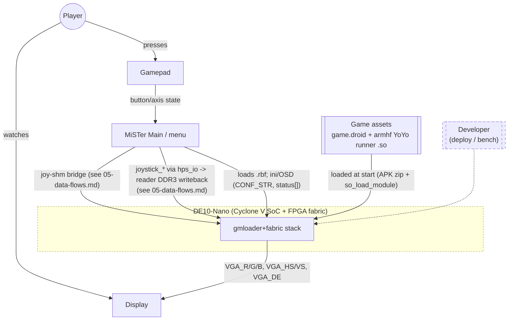

# System Context (C1)

**What this answers:** who and what talks to the gmloader+fabric stack at
runtime, and over which interface — the outermost view before any internal
decomposition.

## Actors

**Player.** Plays the game with a gamepad and watches a display; no direct
interface to the system beyond those two devices.

**Gamepad.** A physical controller. MiSTer's `hps_io` module (instantiated in
`maldita.castilla-mister/fpga/Maldita.sv`) surfaces it to the core as
`joystick_0`..`joystick_3` buses over `HPS_BUS`
(`maldita.castilla-mister/fpga/Maldita.sv:33,265-269,282-293`). Separately, a
vendored fork of MiSTer's own supervisor
(`maldita.castilla-mister/vendor/Main_MiSTer/maldita_joy_shm.cpp`) writes a
shared-memory contract that `external/gmloader-next/gmloader/mister/joy_shm_reader.cpp`
reads on the engine side (`mister_joy_shm.h`, `JoyShm_Init`/`JoyShm_ReadMask`).
The FPGA also carries its own live path: `joystick_0`/`joystick_1` are wired
into `openbor_video_reader`, which publishes them into the DDR3 ring each
frame (`maldita.castilla-mister/fpga/Maldita.sv:1073-1076,1131-1137`, comment
tag `[joy-ddr-writeback]`). Two verified paths exist (FPGA DDR writeback and
the host-side joy-shm bridge); which one is authoritative for gameplay input
is a **05-data-flows.md** question, not resolved further here.

**Display.** Analog VGA out. `Maldita.sv` drives `VGA_R`/`VGA_G`/`VGA_B` from
the custom `openbor_video_reader` output and `VGA_HS`/`VGA_VS`/`VGA_DE` from
`openbor_video_timing` (`maldita.castilla-mister/fpga/Maldita.sv:1102-1155`);
`VGA_SCALER` is tied to `1'b0` (`maldita.castilla-mister/fpga/Maldita.sv:229`),
so this core scans out directly rather than through MiSTer's ascal path.

**Game assets** (`game.droid` + armhf YoYo runner `.so`). At start, gmloader's
`main()` opens the configured APK as a zip archive (default `apk_path =
"game.apk"`, `external/gmloader-next/gmloader/configuration.cpp:26`) via
`zip_open` (`external/gmloader-next/gmloader/main.cpp:390-400`), then loads
the runner shared object with `so_load_module("libyoyo.so", apk, ...)`
(`external/gmloader-next/gmloader/main.cpp:415`), and hands it the APK/save
paths through `RunnerJNILib::Startup(...)` (`external/gmloader-next/gmloader/main.cpp:758`).
The actual game data (`game.droid`, per the PortMaster convention this project
canaries against) is read by the runner `.so` itself from the configured save
directory at runtime — not verified line-by-line in `main.cpp`; **unverified**
beyond the APK-open/`.so`-load steps cited above.

**MiSTer Main/menu.** The standard MiSTer platform process: loads this core's
`.rbf` onto the FPGA, drives the OSD from the `CONF_STR` this core defines
(`maldita.castilla-mister/fpga/Maldita.sv:248-261`), and is the source of the
`status[]`/`joystick_*` buses `hps_io` exposes into the core
(`maldita.castilla-mister/fpga/Maldita.sv:263-300`). MiSTer Main also writes
the joystick state that reaches the engine via the joy-shm bridge — see
`05-data-flows.md`. The Master_Daemon/handler exec chain that launches
gmloader itself is out of scope for this doc set (see
`docs/architecture/README.md`).

**Developer** (out-of-scope, dashed). Deploys builds and drives bench runs
from outside the running system — `mister-gmloader/Makefile`,
`maldita.castilla-mister/deploy.py`, `mister-gmloader/scripts/mister_run.sh` —
none of which are runtime actors; included only to show the boundary is
crossed out-of-band, not during gameplay.

## Sources

- `mister-gmloader/README.md` — stack diagram, submodule roles, canary game.
- `external/gmloader-next/gmloader/main.cpp` — entry point, APK/`.so` asset
  loading (`main.cpp:390-420,758`), SDL init incl. joystick/controller
  (`main.cpp:504-551`). Pin: `external/gmloader-next` = `d585b38`.
- `maldita.castilla-mister/fpga/Maldita.sv` — top-level `emu` module: `hps_io`
  instantiation, `CONF_STR`, `joystick_*`/`status[]` buses, VGA output,
  joy-DDR writeback (`Maldita.sv:33,217-300,1073-1155`). Pin:
  `maldita.castilla-mister` = `4ef1353` (milestone-a).
- `external/gmloader-next/gmloader/configuration.cpp` — default `apk_path`.
- `external/gmloader-next/gmloader/mister/joy_shm_reader.cpp`,
  `maldita.castilla-mister/vendor/Main_MiSTer/maldita_joy_shm.cpp` —
  corroborate the joy-shm bridge named in the brief's canonical actor list.

Repo pins: `external/gmloader-next` = `d585b38`; `maldita.castilla-mister` =
`4ef1353` (milestone-a). `mister-fpga-blitter` (sibling, dev-only, not a
submodule of this repo) is not cited by this doc and is therefore not pinned
here — see `docs/architecture/02-containers.md`.
