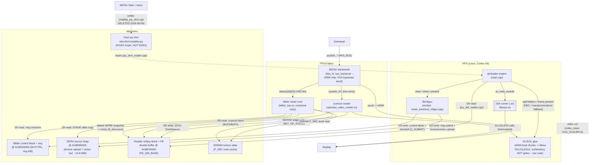

# Containers (C2)

**What this answers:** what the gmloader+fabric stack decomposes into at
runtime — the HPS-side processes/libraries, the FPGA-fabric modules, and the
shared-memory regions between them — and by what mechanism each pair talks.

## Containers

**gmloader engine** (`main.cpp`). The Linux/ARM process: opens the APK, loads
the GM runner, initializes EGL/SDL, drives the frame loop, and dispatches
every GL draw call to either the fabric path (`libmfgpu`) or the software
fallback (GL/EGL glue). Owned by `gmloader-next`. The per-draw dispatch and
device-transport code (`RasterBackend_MFGPU`) live in
`external/gmloader-next/gmloader/mister/raster_backend_mfgpu.cpp` and are
compiled directly into this same binary — not a separate process.

**GM runner (.so)** (`libyoyo.so`). The armhf GameMaker: Studio runner shared
object, loaded at start via `so_load_module("libyoyo.so", apk, ...)`
(`external/gmloader-next/gmloader/main.cpp:415`, cited in `01-context.md`).
It issues GL1/GLES2 calls that the engine intercepts. Not owned by any of the
three pinned repos — it ships inside the game's PortMaster APK.

**GL/EGL glue.** **Discrepancy from the plan:** the canonical name given to
this task was "gl4es/EGL glue," but `gl4es` (the third-party library) does
not appear anywhere in `gmloader-next` — confirmed by an exhaustive grep of
the repo. What actually ships is a custom ARM-hook thunk layer
(`external/gmloader-next/thunks/khronos/gles2.cpp`,
`external/gmloader-next/thunks/khronos/egl.cpp:44` `eglGetProcAddress_impl`)
that intercepts the runner's GL1/GLES2 calls and forwards them to a
standalone **Mesa 21.3.9 surfaceless** build (`EGL_PLATFORM=surfaceless`,
`external/gmloader-next/gmloader/main.cpp:464-474`). This is the software
fallback for draws the fabric backend can't represent (FBO / non-default
render targets, `RB_PREMULT` — see `raster_backend_mfgpu.cpp:1-20`). Mesa
itself is an external build artifact, not part of any of the three pinned
repos (`gmloader-next/CLAUDE.md`, Mesa section).

**libmfgpu.** Host-side geometry/emitter library: converts the engine's
decoded triangle lists into `BLT_OP_TRILIST` fabric commands and manages the
texture-page cache (`external/gmloader-next/gmloader/mister/raster_backend_mfgpu.cpp`,
full clear/draw/present frame model at the top of that file). Its headers
(`blt_emitter.h`, `blt_wire.h`, `blitter_ref.h`) and the reference rasterizer
come from `external/gmloader-next/3rdparty/mfgpu/libmfgpu/mfgpu.h` and
`external/gmloader-next/3rdparty/mfgpu/libmfgpu/mfgpu.c` — a
submodule pointing at `mister-fpga-blitter`, pinned `9ccd57a`
(`git submodule status 3rdparty/mfgpu` inside `gmloader-next`). It is linked
directly into the `gmloader` binary, not shipped as a separate library
despite the name. `mfgpu.h` itself (the small `mfgpu_batch_t` front-end,
lines 1-38) defines no addresses — the verified device address map lives in
`raster_backend_mfgpu.cpp`'s `MISTER_NATIVE_VIDEO` block, below.

**blitter raster core** (`blitter_top.sv`). The fabric's 2D/TRILIST
compositor: walks the DDR3 command ring, resolves per-blit texture reads
through the SDRAM `P_SRC` cache (`src_in_sdram` hardwired `1'b1`,
`maldita.castilla-mister/fpga/rtl/blitter_top.sv:420`), and composites into
on-chip BRAM (`comp_fbram`) rather than DDR3 — the DDR3 framebuffer is a
downstream DMA copy, not the composite target. **Provenance note** (carried
from earlier findings, reconfirmed here): the file is headed "VENDORED from
github.com/gmcnaught/mister-fpga-blitter ... do not edit here; edit upstream
+ re-copy" (`blitter_top.sv:1-2`). The vendored copy in
`maldita.castilla-mister/fpga/rtl/` is what actually synthesizes; the
`mister-fpga-blitter` submodule's own `rtl/` copy is a separate, non-shipping
spike — do not conflate the two when citing "the blitter raster core."

**scanout reader** (`openbor_video_reader.sv`). Reads the active DDR3
framebuffer half (`BUF0`/`BUF1`) during active display and drives
`VGA_R`/`G`/`B`/`HS`/`VS`/`DE` directly (no `ascal`). Also owns the
control/joystick/debug words at `FB_QW_BASE` (control word, `JOY0..3`, cart
control, vsync/liveness-beacon debug words) — see the address-map section
below. Instantiated with `SCANOUT_ONLY=1'b1`
(`maldita.castilla-mister/fpga/Maldita.sv:1103`), which gates the ioctl/cart
path off in the shipping build; the joystick DDR writeback runs regardless
of `SCANOUT_ONLY` (`openbor_video_reader.sv:570-576`).

**MiSTer framework (sys/ascal).** `hps_io` (instantiated
`maldita.castilla-mister/fpga/Maldita.sv:282`, per `01-context.md`) is the
framework's control-plane bridge: it surfaces `CONF_STR`/`status[]` and the
raw `joystick_*` buses this core wires directly into the blitter (OSD bits)
and the reader (live joystick wires). **Discrepancy from the plan:** the
canonical name pairs this container with `ascal`, and `ascal.vhd` does exist
in `maldita.castilla-mister/fpga/sys/ascal.vhd` and is used — but only for
the framework's **HDMI** output path
(`maldita.castilla-mister/fpga/Maldita.sv:971,983`, "the framework's ascal
... does the final HDMI scale"). This core's primary/tested output is analog
**VGA**, and `VGA_SCALER` is tied to `1'b0`
(`maldita.castilla-mister/fpga/Maldita.sv:229`), so VGA scanout bypasses
`ascal` entirely and goes through `video_mixer` fed directly by the custom
reader. Both statements are true simultaneously: `ascal` is real framework
code that runs (for HDMI), and it is also bypassed (for VGA) — not a
dead/unused module, but not on the path this project actually validates on
device (see memory: analog VGA unit is the test device).

## DDR3 / SDRAM address map

Verified in `external/gmloader-next/gmloader/mister/raster_backend_mfgpu.cpp:676-695`
(host device-transport constants) and cross-checked against the RTL source
of truth `maldita.castilla-mister/fpga/rtl/blitter_defs.vh:30-66` (values
agree exactly):

| Region | Address | Source |
|---|---|---|
| Blitter control block (`BLTCTRL`: `C_SUBMIT`..`C_SRCSEL`, qwords 0-7) | `0x3B000000` | `blitter_defs.vh:33`; register indices `raster_backend_mfgpu.cpp:604-607` |
| Command ring A | `0x3B000040` | `blitter_defs.vh:52`; `raster_backend_mfgpu.cpp:687` |
| Command ring B | `0x3B040000` | `blitter_defs.vh:53`; `raster_backend_mfgpu.cpp:688` |
| DDR3 source heap (vertex buf + texture upload) | `0x3B080000`, ~14.8 MiB | `blitter_defs.vh:54`; `raster_backend_mfgpu.cpp:689-690` |
| Off-screen bg-cache compose target | `0x3BF00000` | `blitter_defs.vh:66` (not diagrammed — internal to the blitter's `C_TARGET==2` path, not one of the brief's named regions) |
| Reader ctrl/joy/framebuffer block (`FB_QW_BASE`) | `0x3BF40000` | `maldita.castilla-mister/fpga/Maldita.sv:218-226` (`FB_QW_BASE = 29'h077E8000`), instantiated at `Maldita.sv:1103`; sub-offsets `openbor_video_reader.sv:149-168` (`CTRL_ADDR`+0, `JOY0..3_ADDR`+0x008/0x018/0x020/0x028, `BUF0_ADDR`+0x040, `BUF1_ADDR`+0x40040) |
| Host joystick-writeback P1/P2 read (engine side) | `0x3BF40008` (P1) / `0x3BF40018` (P2) | `external/gmloader-next/gmloader/mister/joy_ddr_reader.cpp:12-16` |
| Host joy-shm (POSIX tmpfs, not DDR3) | `/dev/shm/maldita-joy` | `external/gmloader-next/gmloader/mister/mister_joy_shm.h:22` |

**Discrepancy from the plan's leads:** the plan named a single "control block
@ FB_QW_BASE." Source shows **two distinct control blocks**: the blitter's
`BLTCTRL` at `0x3B000000` (host writes commands + doorbell; fabric consumes)
and the scanout reader's control/joystick word at `FB_QW_BASE = 0x3BF40000`
(fabric writes frame counter + joystick state; host reads). They are ~15 MB
apart in the same 16 MiB blitter window (`0x3B000000`-`0x3C000000`) and serve
opposite write directions — collapsing them into one name would hide that.

**Lead not found in source:** the plan's "scanout counters at
0x3BFB0018/0x3BFB001C" do not match anything in
`openbor_video_reader.sv`. The nearest real registers, both inside the
`FB_QW_BASE`+`0x0E000`-qword ("`VSYNC_ADDR`") word: the ship-path vsync
counter at byte `0x3BFB0000` (low word) / live blitter FSM snapshot at
`0x3BFB0004` (high word) (`openbor_video_reader.sv:676`, `ST_WRITE_VSYNC`),
and the liveness beacon at `0x3BFB0010`/`0x3BFB0014`
(`openbor_video_reader.sv:590-591`, `ST_BEACON`). **Unverified**: no register
at the exact offsets `+0x18`/`+0x1C` was found; treat the brief's number as
wrong rather than a region this doc omits.

**SDRAM texture atlas.** A read cache the blitter's `P_SRC` port samples for
per-pixel texture fetches; staged from the DDR3 source heap via
`BLT_OP_STAGE` burst writes (`maldita.castilla-mister/fpga/rtl/blitter_top.sv:107-126`).
Physically the on-board SDRAM chip, distinct from the DDR3 the HPS/ARM side
uses — texels never touch DDR3 directly once staged (matches the prior
"SDRAM texel archaeology" finding). One structural fact *was* checked here:
`sdram_fb_cache` is instantiated `#(.SDRAM_AW(25))` only
(`maldita.castilla-mister/fpga/Maldita.sv:426`), so its three region-offset
parameters `DST_OFFSET_W`/`SCAN_OFFSET_W`/`SRC_OFFSET_W` all keep their
default `0` (`maldita.castilla-mister/fpga/rtl/sdram_fb_cache.sv:64-66`) —
channel separation comes from the external word addresses the blitter drives,
not from the cache. The **exact SDRAM byte addresses** of the staged atlas
regions therefore come from the host's `blt_stage_surface` allocator and were
not traced for this doc (**unverified**; the file that would settle it is
`external/gmloader-next/3rdparty/mfgpu/host/blt_emitter.c`'s `sdram_off`
assignment).

**Host joy-shm.** POSIX shared memory at `/dev/shm/maldita-joy`
(`MALDITA_JOY_SHM_PATH`, `external/gmloader-next/gmloader/mister/mister_joy_shm.h:22`),
read by `external/gmloader-next/gmloader/mister/joy_shm_reader.cpp`.
**The producer no longer exists (2026-08-04).** It was
`vendor/Main_MiSTer/maldita_joy_shm.cpp`, running inside a patched MiSTer Main;
the `main=` overlay rework deleted it along with the rest of the supervisor,
because the HPS takeover supersedes MiSTer-authoritative input entirely — with
MiSTer killed there is nothing to be authoritative, and the engine reads the
pads directly (see
`docs/superpowers/specs/2026-08-04-hps-takeover-launcher-design.md` §2b.1 and
§3). The engine-side reader is untouched and still wins the transport selection
if anything ever publishes the segment; nothing in-tree does. **Discrepancy
from the plan:** the canonical list files this under "DDR3 shared regions,"
but it is Linux tmpfs, not FPGA-visible DDR3 — the FPGA has no path to it.
It is the second of the two verified joystick channels named in
`01-context.md`; which one (this or the DDR3 writeback above) is
authoritative for gameplay input is a `05-data-flows.md` question.

## f2h / h2f bridge terminology

**f2h** is an attested in-repo term: the arbitrated port both `blitter_top`
and `openbor_video_reader` share to reach DDR3
(`maldita.castilla-mister/fpga/rtl/f2h_slot_mux.sv:2`, "arbitration for the
SHARED f2h arbiter"; `maldita.castilla-mister/fpga/rtl/ddr_blitter_arb.sv:2`,
"2-master f2h DDR arbiter"). This doc uses "f2h" for every FPGA-side
read/write of the shared DDR3 regions above, and "h2f" for the ARM/gmloader
side's `/dev/mem`-mmap'd writes into the same regions — matching how the
project's own memory/finding notes already use the pair. **Unverified beyond
that convention:** a literal Cyclone V `h2f_gp` hard-IP bridge instance does
exist in `maldita.castilla-mister/fpga/sys/sys_top.v:281`, but this doc did
not trace whether the ARM's DDR3 writes actually route through it (DDR3 is
HPS-attached memory the ARM can also reach via its own memory controller) —
the "h2f write" edges above name the *direction and mechanism* (host mmap
write into shared memory the fabric later reads), not a specific hard-IP
instance.

## Sources

- `external/gmloader-next/gmloader/main.cpp` — asset/runner load
  (`main.cpp:415`), EGL surfaceless init (`main.cpp:464-474`). Pin:
  `external/gmloader-next` = `d585b38`.
- `external/gmloader-next/gmloader/mister/raster_backend_mfgpu.cpp` — engine
  <-> fabric dispatch, device address constants (`:676-695`), control-block
  register indices (`:604-607`), `/dev/mem` mmap (`:709-726`).
- `external/gmloader-next/3rdparty/mfgpu/libmfgpu/mfgpu.h` — front-end batch
  struct; no addresses defined here. Submodule pin (inside `gmloader-next`,
  points at `mister-fpga-blitter`) = `9ccd57a`.
- `external/gmloader-next/gmloader/mister/joy_ddr_reader.cpp` — engine-side
  DDR3 joystick reader (`:8-16,42-46`).
- `external/gmloader-next/gmloader/mister/mister_joy_shm.h`,
  `external/gmloader-next/gmloader/mister/joy_shm_reader.cpp` — joy-shm
  contract/consumer.
- `external/gmloader-next/thunks/khronos/gles2.cpp`,
  `external/gmloader-next/thunks/khronos/egl.cpp:44` — the GL/EGL thunk
  layer (confirms no `gl4es`).
- `maldita.castilla-mister/fpga/Maldita.sv` — `FB_QW_BASE` definition
  (`:218-226`), `VGA_SCALER` tie-off (`:229`), reader instantiation
  (`:1103`), blitter instantiation (`:621`), `comp_fb_dma`/`comp_fbram`
  (`:512,527`), `f2h_slot_mux` (`:714`), `ascal`/HDMI note (`:971,983`). Pin:
  `maldita.castilla-mister` = `4ef1353` (milestone-a).
- `maldita.castilla-mister/fpga/rtl/blitter_top.sv` — vendored-copy header
  (`:1-2`), SDRAM `P_SRC`/STAGE ports (`:66,107-126`), `src_in_sdram`
  hardwire (`:420`).
- `maldita.castilla-mister/fpga/rtl/openbor_video_reader.sv` — `FB_QW_BASE`
  parameter (`:44`), region localparams (`:149-168`), vsync/beacon
  writeback (`:590-591,676`).
- `maldita.castilla-mister/fpga/rtl/blitter_defs.vh` — canonical hardware
  address constants (`:30-66`).
- `maldita.castilla-mister/fpga/rtl/f2h_slot_mux.sv`,
  `maldita.castilla-mister/fpga/rtl/ddr_blitter_arb.sv` — "f2h" as an
  in-repo term.
- `maldita.castilla-mister/fpga/sys/sys_top.v` — `h2f_gp` hard-IP instance
  (`:281`), not otherwise traced.
- `maldita.castilla-mister/vendor/Main_MiSTer/maldita_joy_shm.cpp` — joy-shm
  writer. **Deleted 2026-08-04**; kept in this list because the engine-side
  reader still names the contract.
- `docs/architecture/01-context.md` — canonical actor names and the C1
  citations reused here for `hps_io`/`joystick_*` wiring.

Repo pins: `external/gmloader-next` = `d585b38` (its `3rdparty/mfgpu`
submodule, which points at `mister-fpga-blitter`, = `9ccd57a`);
`maldita.castilla-mister` = `4ef1353` (milestone-a).
