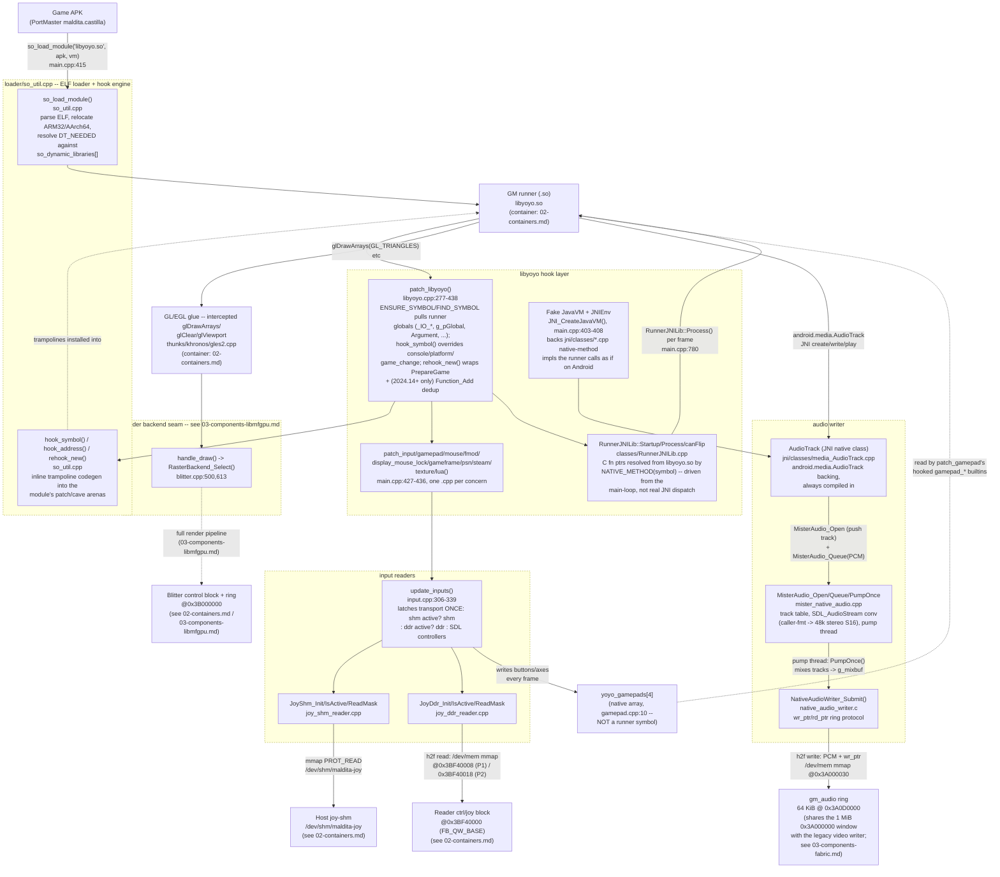

# Components — gmloader engine (C3)

**What this answers:** what the **gmloader engine** container from
`docs/architecture/02-containers.md` is built out of on the host side —
how the ARM/PIE loader gets the GameMaker runner's `.so` running inside a
faked Android/JNI environment, how the engine's native hooks intercept the
runner's GL/input/audio calls, and where each of those three call
categories exits the engine process (into libmfgpu, into one of two input
readers, into the DDR3 audio ring). Render internals past the GL entry point
are `03-components-libmfgpu.md` territory and are not re-documented here.

## Components

**Loader** (`loader/so_util.cpp`, `loader/so_util.h`). A rewritten
Vita-to-Linux ELF loader (header comment credits the original
`gtasa_vita` `so_util.c` by TheOfficialFloW, reworked for ARM32/AArch64
Linux — `so_util.cpp:1-19`). `so_load_module()` maps `libyoyo.so`'s
segments, applies its relocations (including the packed
`DT_ANDROID_REL`/`RELR` encodings a stock glibc loader doesn't understand),
and resolves its `DT_NEEDED` imports against the static/dynamic symbol
tables `main.cpp` registers (`so_static_patches[]`/`so_dynamic_libraries[]`,
`main.cpp:74-83`). `hook_symbol()`/`hook_address()`/`rehook_new()`
(`loader/so_util.h:124-129`) generate inline trampolines into the module's
own patch/cave arenas (padding regions freed up by ELF segment alignment,
`so_util.h:58-61`) — this is the mechanism every hook described below
resolves through; it is not a separate interposer library.

**GM runner (.so)** (`libyoyo.so`). Same container as `02-containers.md`;
not re-described here beyond its role as the thing everything else in this
diagram hooks into or reads from.

**libyoyo hook layer.** Four things run at startup, all invoked from
`main()` right after `so_load_module()` returns (`main.cpp:422-436`):

- **`patch_libyoyo()`** (`libyoyo.cpp:277-438`) is the base layer: it
  resolves ~50 runner globals/functions via `ENSURE_SYMBOL`/`FIND_SYMBOL`
  (fatal vs. warn-only lookups, `so_util.h:30-53`) — the `_IO_*` input
  arrays, `g_pGlobal`/`Argument`/`the_functions` VM state,
  `Variable_*_Direct` accessors — then installs a handful of
  `hook_symbol()` overrides (debug console output, `game_change` for
  chapter-switch relaunch, a lie about the host platform via
  `force_platform_type()`) and one `rehook_new()` reentrant hook on
  `PrepareGame` so the engine knows setup finished
  (`PrepareGame_hook`, `:268-275`). On 2024.14+ runners only (detected by
  mangled-symbol probing, `:404-411`) it also reentrant-hooks `Function_Add`
  to dedupe a YoYo engine bug that null-derefs on a duplicate add
  (`Function_Add_Hook`, `:111-127`).
- **The per-concern patch family** — `patch_input`/`patch_gamepad`/
  `patch_mouse`/`patch_fmod`/`patch_display_mouse_lock`/`patch_gameframe`/
  `patch_psn`/`patch_steam`/`patch_texture`/`patch_lua`, one function per
  `.cpp` file of the same base name, called in sequence
  (`main.cpp:427-436`; `patch_gamepad`/`patch_mouse`/etc. hook the GML
  builtin functions — e.g. `patch_input` hooks `_Z13IO_Start_Stepv` and
  `RegisterAndroidKeyEvent`, `input.cpp:200-205`).
- **`RunnerJNILib`** (`classes/RunnerJNILib.cpp`). Not a hook in the
  trampoline sense — `Startup`/`Process`/`canFlip` are C function pointers
  resolved by symbol name out of `libyoyo.so` (`NATIVE_METHOD("libyoyo.so",
  Process)`, `:21`) and called directly from the main loop
  (`RunnerJNILib::Process(env, 0, ...)`, `main.cpp:780`) — this is the
  "runner .so -> hook layer" per-frame entry the brief asks for.
- **The fake JVM / `jni/classes/*.cpp`.** `JNI_CreateJavaVM()`
  (`main.cpp:403-408`) constructs a `JNIEnv`/`JavaVM` good enough for the
  runner to call Android JNI methods against; `jni/classes/` implements
  those methods natively (e.g. `AudioTrack`, below) so the runner sees a
  working Android runtime instead of a stub.

**GL/EGL glue → render backend seam.** The runner's `GL1`/`GLES2` calls are
intercepted by the thunk layer named in `02-containers.md`
(`thunks/khronos/gles2.cpp`) and land in `blitter.cpp`'s `handle_draw()`,
which calls `RasterBackend_Select()->draw(...)`
(`blitter.cpp:500-620`, `:613`). Everything past that call — the mfgpu vs.
software-fallback split, triangle conversion, ring submit, `C_DONE` poll —
is `03-components-libmfgpu.md`'s scope, reused verbatim here rather than
re-derived.

**Input readers — which one ships.** Two independent reader
implementations exist and **both run every frame** on the shipping build;
there is no runtime or compile-time choice *between them*. The trichotomy
itself is gated: the whole shm/ddr selection block sits inside
`#ifdef MISTER_NATIVE_VIDEO` (`input.cpp:306`), which the canonical build
recipe passes (`MISTER_BUILD=1 MISTER_NATIVE_VIDEO=1`,
`external/gmloader-next/CLAUDE.md`) — a build without it falls through to raw
SDL `GameController` polling only. This is the same `#ifdef` noted below for
`patch_bench_godmode`. `update_inputs()` (`input.cpp:306-339`) calls
`JoyShm_Init()` and `JoyDdr_Init()` once each (both attempted, result
latched forever — `g_joyshm_ready`/`g_joyddr_ready`, `:307-317`), then
picks per-frame with `(g_joyshm_ready == 1) ? JoyShm_ReadMask(p) :
JoyDdr_ReadMask(p)` (`:327-328`), falling through to polling raw SDL
`GameController` state only if *neither* transport is active
(`:318-339`). The in-source comment at the call site states the intent
plainly: joy-shm is "explicit opt-in; wins when a producer is running",
joy-ddr is "the default path" (`input.cpp:322-325`). So: **joy-ddr
(`joy_ddr_reader.cpp`) is what ships/runs by default**; joy-shm
(`joy_shm_reader.cpp`) silently takes over only when a Main_MiSTer-side
shm producer (`maldita_joy_shm.cpp`, per `02-containers.md`) happens to be
running and publishes the shm file before the first frame. Both write into
the same native `yoyo_gamepads[4]` array (`gamepad.cpp:10` — an
engine-owned array, not a runner symbol) via the shared
`JoyShm_MaskToButtons()` bit layout (`joy_shm_reader.cpp:12-26`), which
`patch_gamepad`'s hooked GML `gamepad_*` builtins then read
(`gamepad.cpp:60,123,164,...`). `joy_ddr_reader.cpp` reads
`0x3BF40000`+`0x008`/`0x018` (P1/P2, `joy_ddr_reader.cpp:12-16`) — the same
`FB_QW_BASE` region `02-containers.md`'s address table cites for the
scanout reader's control/joystick words; `joy_shm_reader.cpp` reads
`/dev/shm/maldita-joy` (POSIX tmpfs, not FPGA-visible).

**Audio writer — engine-side chain.** `android.media.AudioTrack` is the
runner's only *compiled-in* PCM producer on the shipping build: JNI class
`jni/classes/media_AudioTrack.cpp` opens a **push**-mode track
(`desired.callback = NULL`, `media_AudioTrack.cpp:39,44` — `tr->pull =
(desired->callback != nullptr)` evaluates false, `mister_native_audio.cpp:227`)
via `MisterAudio_Open()` when the shim is active, falling back to
`SDL_OpenAudioDevice()`/`SDL_QueueAudio()` only if it is not
(`media_AudioTrack.cpp:44-45,123-127`). **Two other producers exist in
source but are not part of the shipping binary**: `video_ffmpeg.cpp`
(cutscene audio, gated by `VIDEO_SUPPORT=1`) and `fmod.cpp`
(gated by `USE_FMOD=1`, `Makefile.gmloader:100-102`) — neither flag is
passed by the build recipe in `gmloader-next/CLAUDE.md`
(`MISTER_BUILD=1 MISTER_NATIVE_VIDEO=1` only), so those two files are
compiled out; both would route through the same `MisterAudio_Open`/
`MisterAudio_Queue` API if enabled (`video_ffmpeg.cpp:159-160,350`),
confirming the header comment in `mister_native_audio.h:4-5` names the
*intended* producer set, not the shipping one.
`mister_native_audio.cpp`'s track table (up to `MISTER_AUDIO_MAX_TRACKS=4`,
`mister_native_audio.h:30`) converts each track's own format to 48 kHz
stereo S16 via `SDL_AudioStream` (`MisterAudio_Open`,
`mister_native_audio.cpp:200-239`), then a dedicated pump thread
(`pump_main`, `:130-140`, pinned to core 1 when `MisterAudio_Init()` can —
`:162-173`) calls `MisterAudio_PumpOnce()` in a tight ring-driven loop:
top the ring back up to a ~100 ms target (`kTargetFillFrames=4800`,
`:32`), mix every open unpaused track with saturating add
(`sat_add_s16`, `:41-46`), and hand the result to
`NativeAudioWriter_Submit()` (`:294-348`). `native_audio_writer.c` owns the
actual `/dev/mem` mmap of the shared `0x3A000000` 1 MiB window
(`NA_DDR_PHYS_BASE`, `:25`) and the ring protocol: PCM bytes copied into a
64 KiB ring at `+0x000D0000` (`NA_RING_OFFSET`, `:29`, i.e. byte
`0x3A0D0000`), then `wr_ptr` at `+0x30` written **after** a
`__sync_synchronize()` barrier so the FPGA never observes advanced
`wr_ptr` before the bytes it points past (`:130-150`). This ring, its
`rd_ptr` writeback, and the fabric consumer (`gm_audio.sv`) are documented
on the fabric side in `03-components-fabric.md` ("(c) gm_audio —
included") — not re-derived here.

## Unverified

- **FMOD's actual SDL audio backend** (`fmod.cpp`'s `FMOD_SDL_Register`)
  is a closed-source FMOD SDK call; whether it would route through
  `MisterAudio_Open` if `USE_FMOD=1` were ever built is inferred from the
  `mister_native_audio.h` header comment, not traced into FMOD's own
  source (not vendored in this repo).
- **`patch_gameframe`/`patch_psn`/`patch_steam`/`patch_texture`/
  `patch_lua`/`patch_display_mouse_lock`** (`stubs/stubs_*.cpp`,
  `display_mouse_lock.cpp`, `texture.cpp`, `lua.cpp`) were confirmed only
  by their call sites in `main.cpp:427-436`, not read in detail — they are
  outside the brief's three named call categories (render/input/audio) and
  are mostly Android-service stubs.
- **`patch_bench_godmode`** (`mister/bench_godmode.cpp`, only called under
  `#ifdef MISTER_NATIVE_VIDEO`, `main.cpp:437-439`) is a benchmark harness
  hook (see the project's bench-results/ tooling); not traced here as it is
  not part of the normal render/input/audio dataflow.

## Sources

- `external/gmloader-next/gmloader/main.cpp` — runner load (`:415`),
  patch-family call sequence (`:422-439`), fake JVM (`:403-408`), main
  loop / `RunnerJNILib::Process` (`:780`), present-path backend dispatch
  (`:785-829`). Pin: `external/gmloader-next` = `d585b38`.
- `external/gmloader-next/loader/so_util.cpp`,
  `external/gmloader-next/loader/so_util.h` — ELF loader/hook engine
  (header note `:1-19`; `so_module`/hook prototypes `so_util.h:57-129`).
- `external/gmloader-next/gmloader/libyoyo.cpp`,
  `external/gmloader-next/gmloader/libyoyo.h` — `patch_libyoyo`
  (`:277-438`), `Function_Add_Hook` (`:111-127`), `PrepareGame_hook`
  (`:268-275`), `yoyo_gamepads` extern (`libyoyo.h:252`).
- `external/gmloader-next/gmloader/classes/RunnerJNILib.cpp` — native
  method table resolved by symbol (`:19-54`).
- `external/gmloader-next/thunks/khronos/gles2.cpp` — the GL/EGL glue thunk
  layer that intercepts the runner's `glDrawArrays`/`glClear`/`glViewport`
  before `blitter.cpp`'s `handle_draw()`; the container itself is established
  in `docs/architecture/02-containers.md` and not re-derived here.
- `external/gmloader-next/gmloader/input.cpp` — input-reader init/select
  (`:306-339`), `patch_input` (`:200-205`).
- `external/gmloader-next/gmloader/gamepad.cpp` — `yoyo_gamepads[4]`
  definition (`:10`), hooked GML gamepad builtins (`:47-336`).
- `external/gmloader-next/gmloader/mister/joy_shm_reader.cpp`,
  `external/gmloader-next/gmloader/mister/joy_shm_reader.h` — shm reader,
  bit-layout mapping (`:12-26`), init/read (`:36-57`).
- `external/gmloader-next/gmloader/mister/joy_ddr_reader.cpp`,
  `external/gmloader-next/gmloader/mister/joy_ddr_reader.h` — DDR reader,
  `FB_QW_BASE` offsets (`:8-16`), init/read (`:20-48`).
- `external/gmloader-next/jni/classes/media_AudioTrack.cpp` —
  `android.media.AudioTrack` JNI native impl, `MisterAudio_Open` call site
  (`:44-45`), push-mode `MisterAudio_Queue` (`:123`).
- `external/gmloader-next/gmloader/mister/mister_native_audio.cpp`,
  `external/gmloader-next/gmloader/mister/mister_native_audio.h` — track
  table, `SDL_AudioStream` conversion, pump thread + core pinning
  (`:130-178`), `MisterAudio_PumpOnce` mix pass (`:294-348`), producer-set
  header comment (`mister_native_audio.h:4-5`).
- `external/gmloader-next/gmloader/mister/native_audio_writer.c`,
  `external/gmloader-next/gmloader/mister/native_audio_writer.h` — DDR3
  ring mmap + protocol (`:25-31,40-86`), submit + barrier (`:123-150`),
  address-map header comment (`native_audio_writer.h:7-10`).
- `external/gmloader-next/gmloader/video_ffmpeg.cpp` — gated
  `MisterAudio_Open`/`Queue` cutscene-audio call sites (`:159-160,350`).
- `external/gmloader-next/gmloader/fmod.cpp` — `#ifdef USE_FMOD` gate
  (`:1`), `FMOD_SDL_Register` (`:33`).
- `external/gmloader-next/gmloader/mister/frame_capture.cpp` — software
  present-path `glReadPixels`/scale/RGB565 (used by the non-fabric backend
  present path in `main.cpp:801-827`; not part of the render/input/audio
  hook chain documented above beyond that call site).
- `external/gmloader-next/Makefile.gmloader` — `VIDEO_SUPPORT`/`USE_FMOD`
  opt-in flags (`:100-114`), shipping build's `MISTER_WIDTH`/`HEIGHT`
  defines (`:126-127`).
- `external/gmloader-next/CLAUDE.md` — canonical build recipe
  (`MISTER_BUILD=1 MISTER_NATIVE_VIDEO=1`, no `VIDEO_SUPPORT`/`USE_FMOD`),
  used to determine which audio producers are actually compiled in.
- `docs/architecture/02-containers.md` — container names (**gmloader
  engine**, **GM runner (.so)**, **GL/EGL glue**), `FB_QW_BASE`/joy-shm
  region names, reused verbatim here.
- `docs/architecture/03-components-libmfgpu.md` — the render pipeline this
  doc's `handle_draw()` edge hands off to; not re-derived here.
- `docs/architecture/03-components-fabric.md` — `gm_audio.sv` (the fabric
  consumer of the ring this doc's audio-writer chain fills) and its
  `0x3A0D0000` address confirmation.

Repo pins: `external/gmloader-next` = `d585b38` (its `3rdparty/mfgpu`
submodule = `9ccd57a`); `maldita.castilla-mister` = `4ef1353` (milestone-a,
cited only via cross-references, not read directly for this doc).
