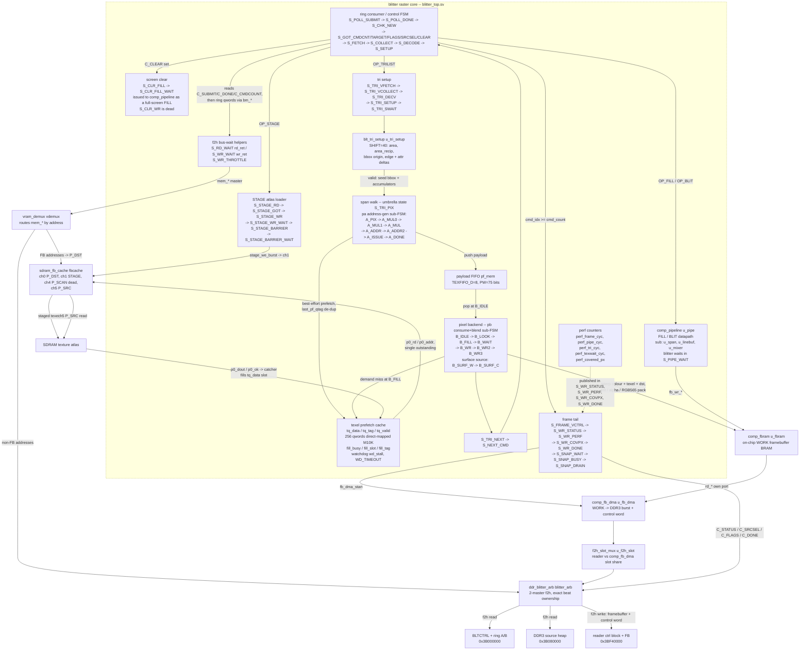
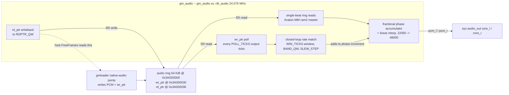

# Components — maldita FPGA core (C3)

**What this answers:** what the three fabric-side containers from
`docs/architecture/02-containers.md` — **blitter raster core**, **scanout
reader**, **MiSTer framework (sys/ascal)** — are actually built out of: which
RTL modules exist, which FSM states carry the work, where texels and pixels
come from and go, and which components publish the numbers the benches read.
Every component name below is the literal module, instance, state, or register
name in the vendored production RTL.

**Convention for upstream/downstream.** Each component's neighbours are given
narratively inside its paragraph, matching `docs/architecture/02-containers.md`.
The explicit `**Upstream:**`/`**Downstream:**` labels appear only where a
component's neighbours are *not* the ones the diagram edge above implies (the
ring consumer, whose upstream is the host; and `gm_audio`, whose downstream is
`audio_out`'s `core_l`/`core_r` rather than the `alsa_*` port a reader would
assume). Absence of the labels is not an omission.

**Scope and provenance.** All RTL cited here is the **vendored production copy**
under `maldita.castilla-mister/fpga/rtl/`, pinned `4ef1353` (milestone-a). That
is what the Quartus project compiles — the file list is
`maldita.castilla-mister/fpga/files.qip`. The separate sibling checkout
`mister-fpga-blitter` (dev-only, not a submodule of this repo) is the
contract/host-reference and simulation home (`libmfgpu`, `blitter_ref.h`); its
own `rtl/` tree is **not** what ships and is never cited as such.

Two files the brief names need a status correction up front, both taken from
`maldita.castilla-mister/fpga/files.qip:14-17`:

- `maldita.castilla-mister/fpga/rtl/blt_tri.sv` is the **sim-only golden**
  reference rasterizer. It is *not* in the synthesized file list and *not*
  instantiated anywhere. It defines the bit-exactness target, not a component.
- `maldita.castilla-mister/fpga/rtl/blt_blend.sv` **is** compiled
  (`files.qip:17`) but is **instantiated nowhere**. Its blend arithmetic was
  hand-inlined into `blitter_top.sv`'s three-stage `B_WR`/`B_WR2`/`B_WR3`
  pipeline, deliberately kept byte-identical
  (`maldita.castilla-mister/fpga/rtl/blitter_top.sv:874-880`). It is a live
  bit-exactness reference in the netlist sense only.

---

## (a) Blitter raster core

### Components

**ring consumer / control FSM** — `maldita.castilla-mister/fpga/rtl/blitter_top.sv:1045-1198`.
The outer loop. `S_POLL_SUBMIT`/`S_POLL_DONE`/`S_CHK_NEW` poll `C_SUBMIT` and
`C_DONE` at `BLTCTRL_QW`; when they differ a frame starts, the per-frame perf
counters reset (`:1061-1063`), and the control block is walked
(`S_GOT_CMDCNT`, `S_GOT_TARGET`, `S_GOT_FLAGS`, `S_GOT_SRCSEL`, `S_GOT_CLEAR`).
`S_FETCH`/`S_COLLECT` then pull each 4-qword command from `ring_base`
(`ring_sel` selects `RING_QW` or `RING_B_QW`, `:294-295`, `:1095`),
`S_DECODE` unpacks the wire ABI (`:1159-1186`), and `S_SETUP` dispatches by
opcode. **Upstream:** `libmfgpu`'s h2f writes into `BLTCTRL` + ring.
**Downstream:** the STAGE, comp_pipeline, clear, and TRILIST paths below.

**f2h bus-wait helpers** — `blitter_top.sv:1906-1935`. Every FSM-driven DDR3
access parks in `S_RD_WAIT` (returning to `rd_ret`) or `S_WR_WAIT` (returning to
`wr_ret`); `S_WR_THROTTLE` idles `WR_THROTTLE` cycles after a write to leave
scanout bandwidth. `S_RD_WAIT` carries the reissue watchdog (`rw_wd`,
`RW_WD_MAX`, `:1038-1042`) that fixed the startup wedge.

**STAGE atlas loader** — `blitter_top.sv:1239-1305`. `BLT_OP_STAGE` copies bytes
from the DDR3 source heap into the SDRAM atlas: `S_STAGE_RD` issues the DDR3
beat read, `S_STAGE_GOT` captures it, `S_STAGE_WR`/`S_STAGE_WR_WAIT` push it out
of the `stage_*` burst-write port into `sdram_fb_cache` channel **ch1**, then
`S_STAGE_BARRIER`/`S_STAGE_BARRIER_WAIT` pulse `stage_barrier` so the cache
flushes ch1 and invalidates ch5 before any texel is read
(`maldita.castilla-mister/fpga/rtl/sdram_fb_cache.sv:1-38`,
`maldita.castilla-mister/fpga/Maldita.sv:449-457`).

**comp_pipeline `u_pipe`** — `blitter_top.sv:1947`, module at
`maldita.castilla-mister/fpga/rtl/comp_pipeline.sv:35`. The 2D FILL/BLIT
datapath (the non-triangle path). It owns the shared `mem_*` master only while
`pipe_busy`; the blitter FSM waits in `S_PIPE_WAIT` for `blit_done`. Its own
sub-instances are `comp_span_setup u_span`, `comp_src_linebuf u_linebuf`, and
`comp_mixer u_mixer` (`comp_pipeline.sv:139,165,201`). It writes pixels into
`comp_fbram`, not DDR3.

**screen clear** — `blitter_top.sv:1101-1131`. When `cfg_flags[0]` is set,
`S_GOT_CLEAR` synthesizes a full-screen `OP_FILL` command and routes it through
`comp_pipeline` (`S_CLR_FILL` → `S_CLR_FILL_WAIT` → `S_FETCH`) so the clear
lands in the on-chip `comp_fbram`. `S_CLR_WR` — the old bm_*-driven SDRAM clear
loop — is explicitly **dead** and unreachable, kept only so `wr_ret` references
still resolve (`:1133`).

**tri setup + `blt_tri_setup u_tri_setup`** — `blitter_top.sv:1306-1379`;
instance at `:857`, module at
`maldita.castilla-mister/fpga/rtl/blt_tri_setup.sv:86`. `S_TRI_VFETCH` issues
the vertex-qword read, `S_TRI_VCOLLECT` collects the 6 qwords (3 verts x 2),
`S_TRI_DECV` unpacks x/y/u/v/rgba, `S_TRI_SETUP` pulses `start`, and
`S_TRI_SWAIT` waits for `valid` then seeds the bbox and the running edge/attr
accumulators. `u_tri_setup` computes, once per triangle: signed `area`,
`area_recip` at `SHIFT=40`, the bbox-min origin `ox`/`oy`, and the per-x /
per-row integer deltas for coverage and every interpolated attribute — so the
walk needs no per-pixel divide. Degenerate triangles (`area==0`) are reported and
skipped (`:1356-1359` routes straight to `S_TRI_NEXT`).

**span walk (`pa` sub-FSM)** — `blitter_top.sv:1409-1559`, states declared at
`:497-498`. Runs every cycle under the umbrella main state `S_TRI_PIX`
(`:1374`, "umbrella S_TRI_RUN" in the comment — **there is no `S_TRI_RUN`
state**, see the naming note below). `A_PIX` evaluates coverage from `w0/w1/w2`,
advances the `(tri_px, tri_py)` cursor immediately on dispatch, and latches the
`W*area_recip` operands; `A_MUL0`/`A_MUL1`/`A_MUL` do and round the multiply;
`A_ADDR` registers the `itv*stride` texel-row product, `A_ADDR2` adds the byte
offset and forms `pa_qtag`; `A_ISSUE` pushes the pixel payload into the FIFO
(stalling while `pf_full`) and best-effort kicks a prefetch fill; `A_DONE`
parks when the cursor leaves the bbox.

**payload FIFO `pf_mem`** — `blitter_top.sv:523-535`. Depth `TEXFIFO_D=8`,
payload width `PW=75` (`{ca,cb,cg,cr, dst_qw, dst_lane, qtag, texlane}`). It is
the rendezvous that lets `pa` run up to 8 pixels ahead of `pb`; `pb` consumes
the popped `b_*` copies rather than the live registers.

**pixel backend (`pb` sub-FSM)** — `blitter_top.sv:1579-1758`, states declared at
`:515-519`. `B_IDLE` pops `pf_head` into `b_cr/b_cg/b_cb/b_ca/b_dst_qw/
b_dst_lane/b_qtag/b_tex_lane` and hoists the `comp_fbram` destination read;
`B_LOOK` presents the cache slot as a registered address; `B_FILL` does the
tag/valid compare off the registers and either uses the hit or issues a demand
fill; `B_WAIT` stalls until the outstanding fill lands, then re-reads. The blend
is the three-stage `B_WR` (tint + alpha combine) → `B_WR2` (per-channel MAC) →
`B_WR3` (`/255`, `/31`, `/63` reduce, RGB565 pack, `comp_fbram` write), byte-
identical to `blt_blend.sv`. `B_SURF_W`/`B_SURF_C` are the app-surface texel
source: a 1-cycle `comp_fbram` `surf_rd` BRAM read that bypasses the texel cache
and P_SRC entirely (`:556-561`).

**texel prefetch cache** — `blitter_top.sv:563-646`. Direct-mapped, `TEXQ_N=256`
qwords, slot = `qtag[7:0]`, tag = `qtag[23:8]`. `tq_data` and `tq_tag` are
`(* ramstyle = "no_rw_check, M10K" *)` arrays whose read lives in its **own bare
`always @(posedge clk)` block** (`:634-638`) — nesting it inside an FSM case arm
is what broke M10K inference and cost -0.983 ns setup (`:583-592`; matches the
recorded STA-regression finding). `tq_valid` stays in flops for the one-cycle
bulk clear on the per-command barrier. A single-outstanding fill arbiter
(`fill_busy`, `fill_slot`, `fill_tag`) is the sole owner of `tri_p0_rd` /
`tri_p0_addr`; an always-listening catcher writes the slot the cycle `p0_ok`
strobes (`:1388-1391`). `tq_rdw_bad` (`:643-645`) forces the miss path when a
read collides with a same-slot catcher write. A fill watchdog
(`wd_stall`, `WD_TIMEOUT = 4096`, `wd_fire_count`) self-heals a lost `p0_ok`
by synthesizing a completion with stale data (`:1394-1397`).

**SDRAM texture atlas path** — `src_in_sdram` is hardwired `1'b1`
(`blitter_top.sv:420`) and fed to `comp_pipeline`'s `c_srcsel` (`:1971`). Every
source read — the 2D pipeline's and the triangle backend's alike — leaves via the
muxed `p0_*` port (`:2066`) into `sdram_fb_cache` channel **ch5 P_SRC**
(`maldita.castilla-mister/fpga/Maldita.sv:446-450`). There is no DDR3
live-source path left. Confirms the recorded lead.

**perf counters** — `blitter_top.sv:300-322`, accumulated at `:1016-1031`.
`perf_frame_cyc` (cycles not `idle`), `perf_pipe_cyc` (cycles `pipe_busy`),
`perf_tri_cyc` (cycles with `state >= S_TRI_VFETCH`), `perf_texwait_cyc`
(cycles with `state==S_TRI_PIX && pb==B_WAIT`), `perf_covered_px` (incremented
per covered pixel at `:1423`). All reset per frame in `S_CHK_NEW`.

**frame tail + writeback order** — `blitter_top.sv:1776-1889`. Ordered
`S_FRAME_VCTRL` → `S_WR_STATUS` (`C_STATUS`, hi = `perf_texwait_cyc`) →
`S_WR_PERF` (`C_SRCSEL`, hi = `perf_tri_cyc`, `be=0xF0`) → `S_WR_COVPX`
(`C_FLAGS`, hi = `perf_covered_px`, `be=0xF0`) → `S_WR_DONE` (`C_DONE`, low =
`submit_reg`, hi = `perf_frame_cyc`) → `S_SNAP_WAIT` → `S_SNAP_BUSY` →
`S_SNAP_DRAIN` → back to `S_POLL_SUBMIT`. `C_DONE` is deliberately the **tail**:
it is the host's release barrier, so every perf word is in DDR3 before the host
is allowed to return (`:1786-1789`, `:1848-1851`). `S_FRAME_VCTRL` no longer
writes any control word — `comp_fb_dma` is the sole control-word producer
(`:1776-1782`).

**`comp_fbram u_fbram` / `comp_fb_dma u_fb_dma`** — instantiated at the core top,
`maldita.castilla-mister/fpga/Maldita.sv:512` and `:527`; module header
`maldita.castilla-mister/fpga/rtl/comp_fb_dma.sv:1-32`. The composite target is
on-chip BRAM (`comp_fbram`), never DDR3. On the `fb_dma_start` pulse from
`S_SNAP_WAIT`, `comp_fb_dma` latches the **back** buffer (`~disp_active`),
bursts all 15552 WORK qwords into `BUF0`/`BUF1`, and only then writes the single
control-word qword at `FB_QW_BASE+0` — order is load-bearing so the reader never
swaps onto a half-written buffer.

**`vram_demux vdemux`** — `Maldita.sv:785`, module
`maldita.castilla-mister/fpga/rtl/vram_demux.sv:31`. Routes the blitter's single
`mem_*` master by address: framebuffer addresses go to the SDRAM `P_DST`
channel, everything else to the DDR3 arbiter.

**`ddr_blitter_arb blitter_arb`** — `Maldita.sv:749`, module
`maldita.castilla-mister/fpga/rtl/ddr_blitter_arb.sv:45`. The 2-master f2h DDR3
arbiter: reader is default owner (m0), blitter borrows idle gaps (m1). Read
beats are routed by an **exact expectation queue** keyed on accept order, not by
grant state — the fix for the mis-steered-beat garbage-TRILIST fault
(`ddr_blitter_arb.sv:6-40`).

**`f2h_slot_mux u_f2h_slot`** — `Maldita.sv:714`, module
`maldita.castilla-mister/fpga/rtl/f2h_slot_mux.sv:104`. Time-shares the
arbiter's single *reader slot* between `openbor_video_reader` and
`comp_fb_dma`. Contract (`f2h_slot_mux.sv:35-60`): the reader wins whenever it
has a pending request; the reader always receives its return beats; the copy
cannot starve — after `STARVE_MAX` blocked cycles it takes one beat, measured at
<= 8 cycles per escape grant. `STARVE_MAX = 16'd1024` (`f2h_slot_mux.sv:109`)
and the instantiation overrides no parameters.

**`sdram_fb_cache fbcache`** — `Maldita.sv:426`, module
`maldita.castilla-mister/fpga/rtl/sdram_fb_cache.sv:41`. A `jtframe_cache_mux`
over one `jtframe_burst_sdram`, with **ch0 = P_DST** (compositor destination,
r/w), **ch1 = STAGE** (write-only atlas loads), **ch4 = P_SCAN** (tied off —
scanout moved to the DDR3 reader), **ch5 = P_SRC** (blitter source reads). It
also runs the coherency sequencer: `vs` rising flushes ch0 and invalidates
ch0/4/5; `stage_barrier` flushes ch1 and invalidates ch5.

---

## (b) Scanout reader and framework glue

```mermaid
flowchart TB
    subgraph RDR["scanout reader -- openbor_video_reader.sv, SCANOUT_ONLY=1"]
        Idle["ST_IDLE\nonly entered on timeout / frame end"]
        Poll["ST_POLL_CTRL\nJOY + beacon anchor;\nreads CTRL_ADDR when idle"]
        WaitC["ST_WAIT_CTRL\nTIMEOUT_MAX guard"]
        Check["ST_CHECK_CTRL\nlatch active_buffer + buf_base_addr\nfor the whole frame"]
        RdLine["ST_READ_LINE\none 72-qword burst per scanline\ngated on !ddr_busy"]
        WaitL["ST_WAIT_LINE\ncount LINE_BURST beats"]
        LineD["ST_LINE_DONE\nadvance display_line"]
        WaitD["ST_WAIT_DISPLAY\nre-anchor to vcount_ddr on underflow"]
        Joy["JOY writeback chain\nST_WRITE_JOY0 -> JOY1 -> JOY2 -> JOY3"]
        Beacon["ST_BEACON\nliveness {dbg_blt, beacon_cnt}"]
        Vsync["ST_WRITE_VSYNC\nprobe/non-SCANOUT_ONLY builds only"]
        Cart["ST_WRITE_CART / ST_WRITE_CART_SIZE\nunreachable: ioctl inputs tied to 0"]
        Paint["ST_PAINT\nBLT_PAINT_TEST only"]
        LineBuf["linebuf 256x64b M10K\nping-pong by vcount[0]"]
        PixOut["pixel out, clk_vid\nlb_q -> RGB565 decode -> r_out/g_out/b_out"]
    end

    Slot2["f2h_slot_mux u_f2h_slot"]
    Arb2["ddr_blitter_arb blitter_arb"]
    RdrCtrl2["reader ctrl/joy block + FB double-buffer\n0x3BF40000 FB_QW_BASE"]

    subgraph FW["MiSTer framework glue"]
        Timing["openbor_video_timing u_timing\nde/hblank/vblank/new_frame/new_line/vcount"]
        HpsIo["hps_io\nCONF_STR, status[], joystick_0..3"]
        Mixer["video_mixer\nVGA_SCALER=0 -> VGA_R/G/B direct"]
        Ascal["ascal\nHDMI path only, bypassed for VGA"]
    end

    Display2["Display"]

    Poll -->|"ddr_rd on CTRL_ADDR"| WaitC
    WaitC --> Check
    Check -->|"new frame counter"| RdLine
    Check -->|"stale, first_frame_loaded"| RdLine
    Check -->|"not synced / no frame"| Idle
    RdLine --> WaitL
    WaitL --> LineD
    LineD -->|"last line"| Idle
    LineD -->|"more lines"| WaitD
    WaitD -->|"new_line_ddr and not vblank"| RdLine
    Check -->|"BLT_PAINT_TEST"| Paint

    Poll -->|"new_frame_pending"| Joy
    Idle -->|"new_frame_pending"| Joy
    Joy -->|"SCANOUT_ONLY ship path"| Poll
    Joy -->|"probe builds"| Vsync
    Vsync --> Poll
    Poll -->|"beacon_pending"| Beacon
    Beacon --> Poll
    Idle -->|"cart_write_pending, never set"| Cart

    Slot2 --> Arb2
    RdLine -->|"f2h burst read of the active half"| Slot2
    Poll -->|"f2h read of the control word"| Slot2
    Joy -->|"f2h write JOY0..3"| Slot2
    Beacon -->|"f2h write"| Slot2
    Arb2 --> RdrCtrl2

    Arb2 -->|"burst beats -> lb_we"| LineBuf
    LineBuf --> PixOut
    Timing -->|"ce_pix, de, vcount, new_line"| PixOut
    Timing --> Mixer
    PixOut -->|"reader_r/g/b -> VGA_R/G/B"| Mixer
    Mixer --> Display2
    Ascal -.->|"HDMI only"| Display2
    HpsIo -->|"joystick_0/1 live wires"| Joy
    HpsIo -.->|"status bits"| Mixer

    style RDR stroke-dasharray: 3 3
    style FW stroke-dasharray: 3 3
```

### Components

**scanout reader** — `maldita.castilla-mister/fpga/rtl/openbor_video_reader.sv`,
instantiated `maldita.castilla-mister/fpga/Maldita.sv:1103` with
`FB_QW_BASE` and `SCANOUT_ONLY=1'b1`. States are declared at `:301-319`. It is
the sole owner of the DDR3 framebuffer scanout and of the joystick/beacon
writebacks the engine reads back.

**`ST_POLL_CTRL` — the real dispatch hub.** `openbor_video_reader.sv:739-761`.
Confirms the recorded lead. It is *not* just a control-word poll: it services
`new_frame_pending` (→ `ST_WRITE_JOY0`) and `beacon_pending` (→ `ST_BEACON`)
**before** it reads `CTRL_ADDR`. The in-source rationale is explicit
(`:740-748`): once frames stream, the fetch loop cycles
`ST_POLL_CTRL → ST_CHECK_CTRL → ST_READ_LINE` without ever visiting `ST_IDLE`,
so anything anchored at `ST_IDLE` starves — the device "input death" where joy
words froze at boot values and the beacon fired exactly once. `ST_IDLE` retains
the same dispatch arms (`:562-585`) but is reached only via timeout or frame
end, so it is a fallback, not the anchor.

**JOY writeback chain** — `openbor_video_reader.sv:600-650`.
`ST_WRITE_JOY0..ST_WRITE_JOY3` write `joystick_0..3` as four single-qword DDR3
writes to `JOY0_ADDR`..`JOY3_ADDR`. It runs **regardless of `SCANOUT_ONLY`**
(`:569-576`). In the shipping build (`SCANOUT_ONLY=1`, no `SOLARUS_DBG_PROBES`)
`ST_WRITE_JOY3` returns to `ST_POLL_CTRL` and `ST_WRITE_VSYNC` is skipped
(`:644-648`). Only `joystick_0`/`joystick_1` carry live `hps_io` wires;
`joystick_2`/`joystick_3` are tied to zero at the instantiation
(`Maldita.sv:1135-1136`).

**`ST_BEACON`** — `openbor_video_reader.sv:588-598`. A free-running 22-bit
`beacon_tick` sets `beacon_pending` (`:470-471`); the state writes
`{dbg_blt, beacon_cnt}` to `VSYNC_ADDR + 2` and returns to `ST_POLL_CTRL`
(labelled "POLL-anchored (IDLE starves)"). `dbg_blt` is the live blitter FSM
snapshot wired in from `blt_dbg_live` (`Maldita.sv:1145`) — which is why the
beacon still reports when the blitter itself is parked.

**Poll-before-issue, confirmed.** The reader never asserts a request into a busy
slot: every state that drives `ddr_rd` or `ddr_we` is guarded by `if (!ddr_busy)`
— `ST_BEACON:589`, `ST_WRITE_JOY0..3:602,613,624,639`, `ST_WRITE_VSYNC:656`,
`ST_WRITE_DBGA:701`, `ST_WRITE_CART:712`, `ST_WRITE_CART_SIZE:729`,
`ST_POLL_CTRL:755`, `ST_READ_LINE:825`, `ST_PAINT:923`. A held request is
dropped only once accepted (`:474-475`, `if (!ddr_busy) ddr_rd <= 1'b0`). The
`ST_READ_LINE` comment states the model in as many words: "gate on `!ddr_busy` so
we only ask when the rdr slot is free (arbiter default-owner model)" (`:822-824`).

**Scanline fetch** — `ST_READ_LINE:817-853` issues one burst of
`LINE_BURST = FB_STRIDE_QW` (72) qwords per display line from
`buf_base_addr + display_line * LINE_STRIDE`. `buf_base_addr` and
`active_buffer` are latched once at `ST_CHECK_CTRL` (`:788-793`) and held for the
whole frame, so a mid-frame `comp_fb_dma` flip cannot tear. The fetch is
**FORWARD** — display row N reads framebuffer row N (`:826-846` explains at
length why the Y-flip does not belong here; it lives at the app-surface
composite on the host side). `ST_WAIT_LINE` counts beats with a `TIMEOUT_MAX`
guard, `ST_LINE_DONE` advances, and `ST_WAIT_DISPLAY:892-912` re-anchors
`display_line` to `vcount_ddr + 1` if the fill has fallen behind, so an
underflow recovers within one line.

**Line buffer and pixel out** — `openbor_video_reader.sv:407` (`linebuf`,
256 x 64 b, `no_rw_check, M10K`), read at `:968` and decoded at `:971-1000`.
Two clock domains: burst beats are written on `ddr_clk` (`:1004-1005`), pixels
are read on `clk_vid` addressed by `{vcount[0], hcol[8:2]}` — a ping-pong keyed
on scanline parity. RGB565 is expanded to 8-bit per channel with bit
replication and gated on `de && frame_ready_vid`. Outputs `r_out`/`g_out`/`b_out`
land on `VGA_R`/`VGA_G`/`VGA_B` directly (`Maldita.sv:1153-1155`).

**`openbor_video_timing u_timing`** — `Maldita.sv:1085`, module
`maldita.castilla-mister/fpga/rtl/openbor_video_timing.sv:25`. Generates
`de`/`hblank`/`vblank`/`new_frame`/`new_line`/`vcount` on `ce_pix_gen`, feeding
both the reader's fetch pacing and its pixel-out counter. `VGA_DE`/`VGA_HS`/
`VGA_VS` come straight from it (`Maldita.sv:1150-1152`).

**`hps_io` / `video_mixer` / `ascal`** — as established in
`docs/architecture/02-containers.md`: `hps_io` (`Maldita.sv:282`) supplies
`CONF_STR`, `status[]`, and the raw `joystick_*` buses; `VGA_SCALER` is tied
`1'b0` (`Maldita.sv:229`) so the analog path runs reader → `video_mixer` → VGA
pins and bypasses `ascal`, which stays live for HDMI only. No new findings at
component level.

---

## (c) gm_audio — included

`gm_audio` **is** a fabric component with real runtime DDR3 traffic, so it is in
scope. Evidence: it is a **sole Avalon-MM master** on `sysmem`'s `ram2` f2h port,
instantiated at `maldita.castilla-mister/fpga/sys/sys_top.v:682` under
`` `ifdef MALDITA_CORE `` — the core takes that port outright instead of routing
it through the vendored `ddr_svc` arbiter, because `ddr_svc` is read-only and
could not carry the read-pointer writeback (`sys_top.v:664-676`). It is compiled
from `maldita.castilla-mister/fpga/files.qip:11`.

**Role.** Native-rate audio consumer for the gmloader DDR3 ring
(`maldita.castilla-mister/fpga/rtl/gm_audio.sv:1-49`). It is structurally
MiSTer's `sys/alsa.sv` with three deliberate differences: both pointer
directions go over DDR3 rather than SPI (nothing on the HPS plays Main_MiSTer's
role); it resamples `SRC_RATE=22050` to `OUT_RATE=48000` with a fractional phase
accumulator and linear interpolation rather than popping one frame per
`ce_sample`; and its slew loop is symmetric, because a userspace pump can fall
behind as easily as run ahead. It runs entirely in `clk_audio` — no CDC.

**Addresses.** Instantiated with **defaults** — `sys_top.v:682-700` overrides no
parameters — so `RING_QW = 29'h0741A000` (byte `0x3A0D0000`),
`WPTR_QW` (byte `0x3A000030`), `RDPTR_QW` (byte `0x3A000038`),
`RING_QWORDS = 8192` (`gm_audio.sv:63-77`). The host side agrees exactly:
`external/gmloader-next/gmloader/mister/native_audio_writer.h:8-10`. Note this
is a **separate DDR3 window from the `0x3B` blitter map** in
`docs/architecture/02-containers.md` — the audio ring is not part of that table,
and `gm_audio.sv:61-63` flags the addresses as absolute qword addresses, not
framebuffer-relative.

**Why the writeback is not optional** (`gm_audio.sv:9-15`): gmloader's
`NativeAudioWriter_FreeFrames()` computes free ring space from `rd_ptr`; without
it the host sees a ring that never drains and clamps every submit to zero.

**Upstream:** the gmloader engine's native-audio pump.
**Downstream:** `pcm_l`/`pcm_r` into `audio_out`'s `core_l`/`core_r` — *not*
`alsa_l`/`alsa_r`, because `aud_mix_top` sums the alsa port unfiltered
(`gm_audio.sv:21-24`).

---

## Naming notes for downstream (C4) work

**Declared-but-dead `S_TRI_*` states.** `blitter_top.sv:183-198` still declares
twelve TRILIST states that are **no longer case arms** — they were replaced by
the `pa`/`pb` sub-FSMs during the Stage 3a pipelining. Verified by grep: each
appears only in its own `localparam` line and in comments. They are
`S_TRI_GOTTEX`, `S_TRI_DSTW`, `S_TRI_DSTC`, `S_TRI_WR`, `S_TRI_ADV`,
`S_TRI_MUL`, `S_TRI_WR2`, `S_TRI_WR3`, `S_TRI_ADDR`, `S_TRI_MUL0`,
`S_TRI_ADDR2`, `S_TRI_MUL1`. The **live** TRILIST main states are exactly
`S_TRI_VFETCH`, `S_TRI_VCOLLECT`, `S_TRI_DECV`, `S_TRI_SETUP`, `S_TRI_SWAIT`,
`S_TRI_PIX`, `S_TRI_NEXT`.

**One more dead main state:** `S_CLR_WR` (`6'd7`) still has a case arm
(`blitter_top.sv:1134-1142`) but is unreachable — its own comment says "dead
since FB-in-BRAM — kept to avoid disturbing `wr_ret` references" (`:1133`). The
live clear path is `S_CLR_FILL` → `S_CLR_FILL_WAIT` → `S_FETCH`.

Two consequences worth carrying forward:

- The `perf_texwait_cyc` declaration comment says "cycles blocked in
  `S_TRI_GOTTEX`" (`:310`). The **code** counts
  `state==S_TRI_PIX && pb==B_WAIT` (`:1029-1030`). The comment names a dead
  state; trust the code.
- `S_TRI_RUN` appears in two comments (`:487`, `:1374`) as the intended name for
  the umbrella state, but **no such state is declared**. The umbrella state is
  literally `S_TRI_PIX = 6'd50`.

**Encoding stability.** `blitter_top.sv:512-514` warns that the raw `pb` values
are decoded by eye when reading device wedge-probe dumps, so renumbering
silently reinterprets historical probe data. Current encodings: `pa` 3-bit
`A_PIX=0 … A_DONE=7`; `pb` 4-bit `B_IDLE=0, B_LOOK=1, B_FILL=2, B_WAIT=3,
B_WR=6, B_WR2=7, B_WR3=8, B_SURF_W=9, B_SURF_C=10` — **4 and 5 are a hole**
(the deleted `B_DSTW`/`B_DSTC`, `:503-504`).

## Reachability of the debug/probe states — verified

- **`ST_WRITE_DBGA` (`5'd22`)** is declared and has a case arm (`:700-709`), but
  is **unreachable in the shipping build**. Its only entry is `state <=
  ST_WRITE_DBGA` at the tail of `ST_WRITE_VSYNC` (`:693`), and with
  `SCANOUT_ONLY=1` and no `SOLARUS_DBG_PROBES` the JOY chain routes
  `ST_WRITE_JOY3` straight back to `ST_POLL_CTRL` (`:644-648`), so
  `ST_WRITE_VSYNC` itself is never entered.
- **`SOLARUS_DBG_PROBES` is not defined in the shipping build.**
  `maldita.castilla-mister/fpga/Maldita.qsf` carries exactly four
  `VERILOG_MACRO` assignments — `MENU_CORE`, `MALDITA_CORE`,
  `MISTER_DISABLE_PALETTE1`, `MISTER_DISABLE_ALSA` (`:11,12,19,29`) — and
  `:31` is a standing comment *"do NOT re-enable SOLARUS_DBG_PROBES ..."*.
  No `` `define SOLARUS_DBG_PROBES `` exists anywhere in `fpga/`.
- **`ST_PAINT` is unreachable in every build.** `BLT_PAINT_TEST` is not a
  build define at all: it is a hardwired `localparam BLT_PAINT_TEST = 1'b0`
  (`openbor_video_reader.sv:185`, comment "borrow-spike off"), read at exactly
  one place (`:800`).
- **`ST_WRITE_CART` / `ST_WRITE_CART_SIZE`** are unreachable in the shipping
  build, but *not* because `SCANOUT_ONLY` gates them — grep shows `SCANOUT_ONLY`
  appears only at `openbor_video_reader.sv:45,47,49,570,574,576,635,647,747`,
  none of them in the cart logic. The actual gate is the instantiation:
  `ioctl_download`, `ioctl_wr`, `ioctl_addr`, `ioctl_dout` are all tied to
  constants (`maldita.castilla-mister/fpga/Maldita.sv:1126-1129`; `:1130` is
  `ioctl_wait`, an *unconnected output*, not a tie-off), so
  `cart_write_pending` (`:522-538`) can never be set. The module's own header
  comment (`:45`) attributes the gating to `SCANOUT_ONLY`; that is imprecise.
- **`STARVE_MAX` = `16'd1024`** (`f2h_slot_mux.sv:109`). The instantiation
  `f2h_slot_mux u_f2h_slot (` (`Maldita.sv:714`) passes no parameter override,
  so the default is the shipping value.

## Unverified

- **SDRAM byte addresses** of the staged atlas regions were not traced, same as
  in `docs/architecture/02-containers.md` — which does record the one checked
  fact, that `sdram_fb_cache`'s `DST_OFFSET_W`/`SCAN_OFFSET_W`/`SRC_OFFSET_W`
  are all default `0` in the shipping instantiation. **Unverified**; the file
  that would settle the rest is the host allocator
  `external/gmloader-next/3rdparty/mfgpu/host/blt_emitter.c`.
- **`comp_pipeline`'s internal FSM state names** were not enumerated — only its
  three sub-instances. It is the 2D path, out of the brief's diagram scope.
  **Unverified**.
- The reader comment block at `openbor_video_reader.sv:960-963` describes
  `ST_READ_LINE` as reading "the reversed SOURCE line (239 - display_line)".
  The **code** at `:847` is forward (`buf_base_addr + display_line *
  LINE_STRIDE`), and the longer comment at `:826-846` explicitly argues for
  forward. The `:960-963` block is stale text; the forward reading is what
  synthesizes.

## Sources

- `maldita.castilla-mister/fpga/rtl/blitter_top.sv` — main FSM state declarations
  (`:150-198`), pa/pb sub-FSM encodings (`:497-521`), payload FIFO
  (`:523-535`), texel prefetch cache (`:563-646`), `src_in_sdram` (`:420`),
  perf counters (`:300-322`, `:1016-1031`), `blt_tri_setup` instance (`:857`),
  inlined blend note (`:874-880`), main case arms (`:1044-1935`),
  `comp_pipeline u_pipe` (`:1947`), `p0_*` owner mux (`:2060-2066`).
- `maldita.castilla-mister/fpga/rtl/blt_tri_setup.sv` — module + port list
  (`:86-110`), fixed-point envelope (`:65-82`).
- `maldita.castilla-mister/fpga/rtl/blt_blend.sv` — module (`:17`), byte-identical
  extraction note (`:1-14`). Compiled, not instantiated.
- `maldita.castilla-mister/fpga/rtl/blt_tri.sv` — sim-only golden; not
  synthesized (`maldita.castilla-mister/fpga/files.qip:15`).
- `maldita.castilla-mister/fpga/rtl/openbor_video_reader.sv` — state declarations
  (`:301-319`), `ddr_busy` release (`:474-475`), beacon timer (`:460-471`),
  `ST_IDLE` (`:562-585`), `ST_BEACON` (`:588-598`), JOY chain (`:600-650`),
  `ST_WRITE_VSYNC` (`:652-684`), `ST_POLL_CTRL` (`:739-762`), `ST_CHECK_CTRL`
  (`:776-815`), `ST_READ_LINE` (`:817-854`), `ST_WAIT_DISPLAY` (`:892-913`),
  `linebuf` (`:407`, `:1004-1005`), pixel out (`:967-1000`).
- `maldita.castilla-mister/fpga/rtl/ddr_blitter_arb.sv` — module (`:45`),
  exact-beat-ownership rationale (`:1-40`).
- `maldita.castilla-mister/fpga/rtl/f2h_slot_mux.sv` — module (`:104`),
  slot-share contract and measured escape cost (`:1-60`).
- `maldita.castilla-mister/fpga/rtl/sdram_fb_cache.sv` — module (`:41`), channel
  map and coherency contract (`:1-38`).
- `maldita.castilla-mister/fpga/rtl/comp_pipeline.sv` — module (`:35`),
  sub-instances `u_span`/`u_linebuf`/`u_mixer` (`:139,165,201`).
- `maldita.castilla-mister/fpga/rtl/comp_fb_dma.sv` — copy-then-control-word
  ordering (`:1-32`).
- `maldita.castilla-mister/fpga/rtl/vram_demux.sv` — module (`:31`).
- `maldita.castilla-mister/fpga/rtl/openbor_video_timing.sv` — module (`:25`).
- `maldita.castilla-mister/fpga/rtl/gm_audio.sv` — design rationale (`:1-49`),
  module + parameters (`:52-90`), Avalon-MM master ports (`:92-104`).
- `maldita.castilla-mister/fpga/Maldita.sv` — `VGA_SCALER` (`:229`), `hps_io`
  (`:282`), `fbcache` (`:426-470`), `comp_fbram` (`:512`), `comp_fb_dma`
  (`:527`), `blitter_top` (`:621`), `f2h_slot_mux` (`:714`), `ddr_blitter_arb`
  (`:749`), `vram_demux` (`:785`), `openbor_video_timing` (`:1085`),
  `openbor_video_reader` (`:1103-1146`), VGA pin assigns (`:1150-1155`).
- `maldita.castilla-mister/fpga/sys/sys_top.v` — `gm_audio` instantiation and the
  ram2-ownership rationale (`:664-700`).
- `maldita.castilla-mister/fpga/files.qip` — the authoritative synthesized file
  list (which settles `blt_tri.sv` vs `blt_blend.sv`, and `gm_audio.sv` at
  `:11`).
- `maldita.castilla-mister/fpga/Maldita.qsf` — the shipping build's complete
  `VERILOG_MACRO` set (`:11,12,19,29`) and the standing
  do-not-re-enable-`SOLARUS_DBG_PROBES` note (`:31`).
- `maldita.castilla-mister/fpga/rtl/f2h_slot_mux.sv` — `STARVE_MAX` default
  (`:109`).
- `external/gmloader-next/gmloader/mister/native_audio_writer.h` — host-side
  audio ring/pointer addresses (`:8-10`). Pin: `external/gmloader-next` =
  `d585b38`.
- `mister-fpga-blitter` (sibling, dev-only, not a submodule of this repo) —
  contract/host-reference and simulation home only; its `rtl/` is not the
  shipping RTL.
- `docs/architecture/02-containers.md` — container names, the `0x3B` address map,
  and the f2h/h2f terminology reused verbatim here.

Repo pins: `maldita.castilla-mister` = `4ef1353` (milestone-a);
`external/gmloader-next` = `d585b38`.
