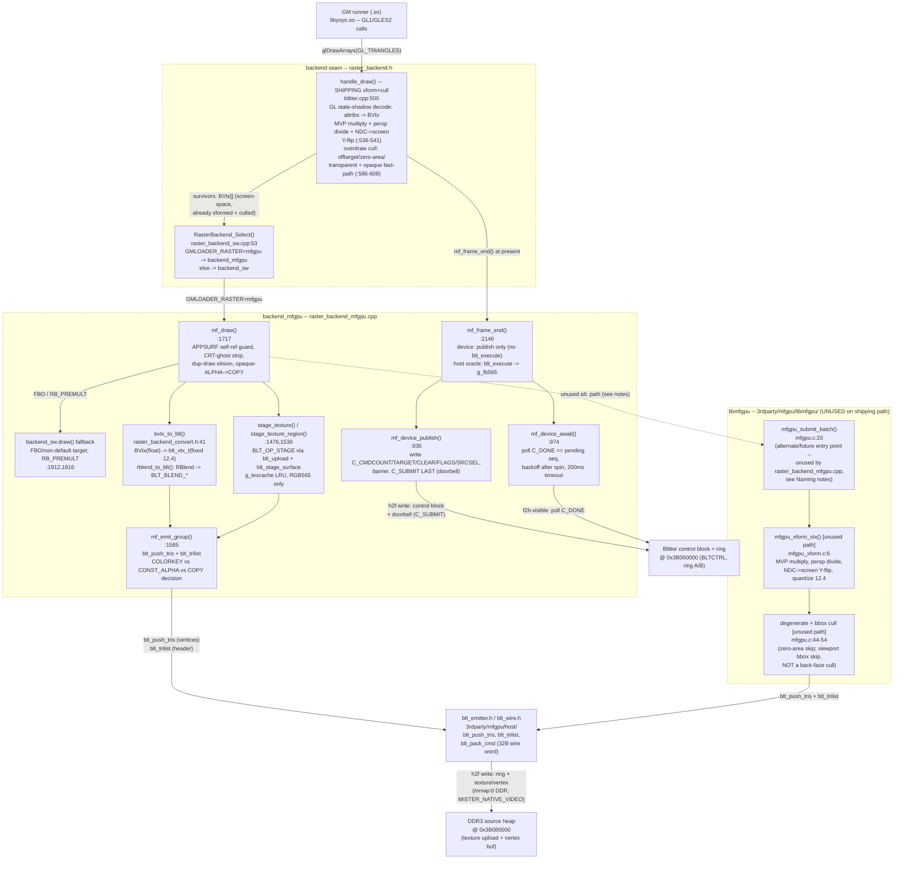

# Components — host renderer / libmfgpu (C3)

**What this answers:** what the **libmfgpu** container from
`docs/architecture/02-containers.md` is actually built out of on the host
side — where a GameMaker draw call enters the fabric path, where
transform/clip/cull happens, where triangles are packed into the wire
format, how the per-frame batch is submitted to the fabric, and how the
host learns the fabric is done — down to real function names.

**Scope and provenance.** libmfgpu (`external/gmloader-next/3rdparty/mfgpu/`)
is a submodule of `gmloader-next` pointing at `mister-fpga-blitter`, pinned
`9ccd57a`. It is compiled directly into the `gmloader` binary (confirmed:
`external/gmloader-next/gmloader/mister/raster_backend_mfgpu.cpp` `#include`s
`libmfgpu/mfgpu.h` and `host/blt_emitter.h` with no separate `.so`/link
target) — matching `02-containers.md`'s "linked directly into the `gmloader`
binary, not shipped as a separate library despite the name." The seam that
selects it (`raster_backend.h`) and the code that calls it
(`raster_backend_mfgpu.cpp`, `blitter.cpp`) live in the `gmloader-next`
superproject, not the submodule.

## Pipeline

**Why no `FB_QW_BASE`/reader-ctrl edge.** This diagram has no node for the
`0x3BF40000` reader ctrl/joy block: that region is read by the **Engine**
container's `joy_ddr_reader.cpp`
(`external/gmloader-next/gmloader/mister/joy_ddr_reader.cpp`, per
`02-containers.md`), not by anything in libmfgpu's render pipeline —
libmfgpu only ever writes into `BLTCTRL`/ring/source-heap (`0x3B0*`).

## Components

**GM runner → backend seam entry (`handle_draw`)** —
`external/gmloader-next/gmloader/mister/blitter.cpp:500-620`. The GL-hook
layer (`thunks/khronos/gles2.cpp`, per `02-containers.md`) calls into
`blitter.cpp`'s intercepted `glDrawArrays`, which lands in `handle_draw()`.
This is where a GameMaker batched draw actually "enters": it reads the
runner's bound vertex attribs (`in_Position`/`in_TextureCoord`/`in_Colour`)
through a GL state shadow, multiplies position by the tracked MVP
(`get_mvp()`), and builds a `std::vector<BVtx>` in **screen-space, GL
bottom-up pixel coordinates** (`blitter.cpp:539-541`,
`blitter_raster.h:75-79` for the `BVtx` struct: `x,y,u,v,r,g,b,a` all
`float`). Overdraw culling (offtarget/zero-area/fully-transparent) and an
opaque-fast-path blend downgrade happen here, before the seam
(`blitter.cpp:586-608`). Then it calls
`RasterBackend_Select()->draw(&rt, &s_verts[0], count/3, &tex, blend, 0.0f,
g_boundTex2D)` (`blitter.cpp:613`).

**Backend seam** (`raster_backend.h`,
`external/gmloader-next/gmloader/mister/raster_backend.h:18-27`). A five-slot
vtable (`frame_begin`/`clear`/`draw`/`present`/`frame_end`) that both
`backend_sw` (`raster_backend_sw.cpp`, thin wrapper over the existing
`blitter_raster.cpp` software rasterizer) and `backend_mfgpu`
(`raster_backend_mfgpu.cpp`) implement identically.
`RasterBackend_Select()` (`raster_backend_sw.cpp:53-60`) is a per-process,
env-cached selector: `GMLOADER_RASTER=mfgpu` routes every `clear`/`draw`/
`present` through `backend_mfgpu`; any other value (including unset) keeps
`backend_sw`. This is the literal "GLES/backend seam" node the brief asks
for — it is a C vtable dispatch inside one process, not a network or IPC
boundary.

**`mf_draw()`** — `raster_backend_mfgpu.cpp:1717-2049`. `backend_mfgpu`'s
`draw` slot. Runs guards specific to the app-surface render-target feature
(self-referential APPSURF draw rejection, CRT-ghost-pass stripping,
duplicate-draw elision) then falls back to `backend_sw.draw()` for two cases
the fabric can't represent: a non-default FBO / non-`WORK` target draw the
fabric's `BLT_OP_SET_TARGET` model doesn't cover yet, and `RB_PREMULT` blend
(`:1812,1816` — the fabric TRILIST rasterizer has no exact premultiplied
`dst = src + dst*(1-a)` blend, per `raster_backend_convert.h:56-58`).
Otherwise it stages the draw's texture (`stage_texture`/
`stage_texture_region`) and converts+emits the triangle list.

**Convert: `bvtx_to_blt()` / `rblend_to_blt()`** —
`external/gmloader-next/gmloader/mister/raster_backend_convert.h:41-68`.
Pure, GL-free, host-testable functions that map the decoded `BVtx`
(float screen x/y, float u/v in \[0,1], float r/g/b/a in \[0,1]) to the
fabric's on-wire `blt_vtx_t` (`3rdparty/mfgpu/refmodel/blitter_ref.h:225-230`):
screen x/y become signed 12.4 fixed-point (`lroundf(v->x * 16.0f)`), u/v
become unsigned 12.4 texel coordinates clamped to \[0,1]×tex_dim, and rgba
is packed via `BLT_RGBA(r,g,b,a)`. `rblend_to_blt()` maps `RB_NONE`→`COPY`,
`RB_ALPHA`/`RB_PREMULT`→`CONST_ALPHA` (nominal; `RB_PREMULT` is actually
diverted to `backend_sw` before reaching here, per the header comment
`:56-58`), `RB_ADD`→`BLT_BLEND_ADD`. This is a **different code path** from
`libmfgpu/mfgpu_xform.c`'s `mfgpu_xform_vtx()` — see Naming notes below.

**Stage: `stage_texture()` / `stage_texture_region()`** —
`raster_backend_mfgpu.cpp:1476-1580`. Uploads the draw's `RTexture` pixels
into the DDR3 source heap as RGB565 (`blt_upload`, never
`blt_upload_argb4444` — the golden TRILIST rasterizer samples the texture
page as RGB565 with no per-texel alpha, `raster_backend_mfgpu.cpp:41-49`),
then stages it into the SDRAM atlas (`blt_stage_surface`, which emits
`BLT_OP_STAGE`, `blt_emitter.h:167-197`). `g_texcache` (256-entry LRU,
`MF_TEX_CACHE_N`) caches by `(tex_id, cropped rect)` so a texture reused
across frames or sub-rects within a spritesheet is uploaded once.
Transparent texels (alpha < 128) are folded into a colorkey sentinel
(`MF_COLORKEY = 0xF81F`, `:391`) so 1-bit-alpha sprites can use
`BLT_BLEND_COLORKEY` instead of `CONST_ALPHA`
(`raster_backend_mfgpu.cpp:51-64`).

**`mf_emit_group()`** — `raster_backend_mfgpu.cpp:1585-1650`. Converts every
vertex of the group via `bvtx_to_blt()`, calls `blt_push_tris(&g_e,
g_vtxscratch, nt)` to bump-append the triangle vertices into the per-frame
vertex entry buffer, then `blt_trilist(&g_e, tex, blend_mode, colorkey,
/*alpha=*/255, eoff, nt, extra_flags)` to emit one `BLT_OP_TRILIST` header
command into the ring pointing at that vertex range
(`blt_emitter.h:228-250`). Picks `BLT_BLEND_COLORKEY` (has_key + fully
opaque vertex alpha), else `rblend_to_blt(bl)` downgraded from
`CONST_ALPHA`→`COPY` when the draw is provably opaque (skips the fabric's
extra destination-read pixel state, `:1618-1635`).

**`mf_frame_end()` → `mf_device_publish()` / `mf_device_await()`** —
`raster_backend_mfgpu.cpp:2146-2237` (frame_end), `:936-968` (publish),
`:974-1035` (await). This is the "ring submit" and "completion poll" the
brief asks for. On the device build (`MISTER_NATIVE_VIDEO`) the emitter's
ring/vertex/texture buffers are the mmap'd DDR3 region directly
(`mf_init_once`, `:1038-1076`; `mf_ddr_map`, `:710-726`, opens `/dev/mem`
and mmaps `0x3B000000` for `MF_DEV_MAP_SIZE = 0x01000000` = 16 MiB), so
`mf_frame_end` does **not** re-copy anything — it publishes the control
block and rings the doorbell. `mf_device_publish()` writes
`C_CMDCOUNT`/`C_TARGET`/`C_CLEAR`/`C_FLAGS`/`C_SRCSEL` (register indices
`MF_C_SUBMIT=0 .. MF_C_SRCSEL=7`, `:604-609`), issues a memory barrier
(`mf_ctrl_barrier`), then writes `C_SUBMIT` **last** — the doorbell —
because the fabric's `S_POLL_SUBMIT`/`S_CHK_NEW` (per
`03-components-fabric.md`) samples the whole control block the instant it
sees `C_SUBMIT` change, so write order is the contract, not cosmetic
(`:610-618`). `mf_device_await()` polls `mf_ctrl_rd(MF_C_DONE) ==
g_pending_seq` in a spin-then-backoff loop (`nanosleep` after
`MF_POLL_SPIN_ITERS`, tunable via `GMLOADER_MFGPU_POLL_US`), with a
`GMLOADER_MFGPU_TIMEOUT_MS`-overridable 200 ms budget
(`MF_DEV_DONE_TIMEOUT_MS`, `:693`) before logging a timeout and leaving
`g_fabric_pending=true` so the next frame drops rather than re-emitting into
a ring the fabric may still be reading (the in-flight-batch guard,
`:1093-1145`). The host (non-device) build skips the `#ifdef
MISTER_NATIVE_VIDEO` MMIO block entirely and instead runs `blt_execute()`
(the software golden model, `3rdparty/mfgpu/refmodel/blitter_ref.h:300-303`)
against the same emitted ring to produce `g_fb565` for host-side parity
tests — there is no C_DONE to poll off-device.

**Device address constants used by the publish/await path** — `MF_DEV_PHYS_BASE
= 0x3B000000`, `MF_DEV_RING_OFF = 0x40`, `MF_DEV_RING_B_OFF = 0x00040000`,
`MF_DEV_SRC_OFF = 0x00080000` (`raster_backend_mfgpu.cpp:676-695`). These are
the same constants `02-containers.md`'s address-map table cites for
`BLTCTRL`/ring A/ring B/DDR3 source heap; not re-derived here, only the
call sites that write/poll them.

## `libmfgpu` proper — public API and the xform stage

`libmfgpu` (`3rdparty/mfgpu/libmfgpu/`) is a small, separately-testable
front-end that the brief names explicitly but that `raster_backend_mfgpu.cpp`
does **not currently call** — see Naming notes. Recorded here because it is
the public API surface a later task (C4) would extend or replace.

**`mfgpu.h`** — `3rdparty/mfgpu/libmfgpu/mfgpu.h:1-38`. The full public API,
five functions:
- `mfgpu_t *mfgpu_create(blt_emitter_t *e)` (`:32`)
- `void mfgpu_frame_begin(mfgpu_t *m)` (`:33`) — calls `blt_begin_frame(m->e,
  0, 0, 0)` (`mfgpu.c:18`)
- `int mfgpu_submit_batch(mfgpu_t *m, const mfgpu_batch_t *b)` (`:34`,
  0=ok) — the batch entry point; body in `mfgpu.c:20-72`
- `void mfgpu_frame_end(mfgpu_t *m)` (`:35`) — calls `blt_end_frame(m->e)`
  (`mfgpu.c:74`)
- `void mfgpu_destroy(mfgpu_t *m)` (`:36`)

`mfgpu_batch_t` (`mfgpu.h:21-28`) is the input contract: a vertex array
(`mfgpu_in_vtx_t{x,y,z,u,v,rgba}`), optional index array, a 16-float
column-major MVP, a texture-page descriptor (`tex_off/w/h/stride/format`), a
`blend` mode, and `screen_w`/`screen_h` for the viewport. `mfgpu.h` itself
defines **no addresses** — matches the discrepancy already recorded in
`02-containers.md`.

**`mfgpu_submit_batch()`** — `mfgpu.c:20-72`. Per submitted batch: (1) calls
`mfgpu_xform_vtx()` on every vertex; (2) assembles triangles (indexed or
sequential) and culls degenerate (zero 2×-area) and fully-offscreen-bbox
triangles against `[0,screen_w<<4]×[0,screen_h<<4]` in 12.4 space
(`:44-54` — explicitly **not** a back-face cull, since the fabric normalizes
winding); (3) pushes survivors via `blt_push_tris` and emits one
`blt_trilist` header for the whole batch (`:58-69`).

**`mfgpu_xform_vtx()`** — `3rdparty/mfgpu/libmfgpu/mfgpu_xform.c:6-24`,
declared `mfgpu_xform.h:14-15`. Multiplies the vertex through the
column-major MVP (`clip = M * [x,y,z,1]`), perspective-divides, maps NDC
`[-1,1]` to screen `[0,screen_w]×[0,screen_h]` with a Y-flip (NDC +y up,
screen +y down), and quantizes to signed 12.4 screen coords / unsigned 12.4
texel coords via `lround(v * 16.0)`.

## NEON claim — checked, false for the shipping conversion code

`mfgpu.h`'s header comment states "The A9 (**NEON**) does transform / clip /
cull here" (`mfgpu.h:6`). The implementation contradicts its own header:
`mfgpu_xform.c:1-2` is headed *"scalar reference transform. A NEON path can
be added later behind the same signature"* — plain C float/double math
(`lround`, no `<arm_neon.h>`, no `__ARM_NEON` guard). `grep -rn
"__ARM_NEON\|arm_neon.h" 3rdparty/mfgpu/` returns nothing. **The NEON claim
in `mfgpu.h`'s comment is aspirational, not implemented** — treat it as
wrong, not merely unverified. NEON *is* real and in use elsewhere in the
host renderer: `blitter_raster.cpp` (`external/gmloader-next/gmloader/mister/blitter_raster.cpp:14-15,87-123,178-274`)
has `#if defined(__ARM_NEON)` blocks (`blend8_alpha_neon`,
`produce_src8_neon`) in the **software rasterizer** (`backend_sw`'s
pixel-fill inner loop), which is a different component from the
transform/clip/cull stage the header comment is actually describing.

## Naming notes for downstream (C4/C7) work

**Two independent convert+cull implementations exist; only one is wired
in.** `raster_backend_mfgpu.cpp` (`backend_mfgpu`, the code that actually
runs on device) does its own conversion inline — `bvtx_to_blt()` /
`rblend_to_blt()` in `raster_backend_convert.h`, called from
`mf_emit_group()` — and never calls `mfgpu_create`/`mfgpu_submit_batch`/
`mfgpu_xform_vtx`. `grep -rn "mfgpu_create\|mfgpu_submit_batch\|mfgpu_frame_begin\|mfgpu_frame_end"
external/gmloader-next/gmloader/` returns nothing. The `libmfgpu` front-end
(`mfgpu.c`/`mfgpu.h`/`mfgpu_xform.c`) is a **parallel, currently-unconsumed**
API surface — its own top comment calls `mfgpu_batch_t` "the contract with
the **future** gmloader interceptor" (`mfgpu.h:9`, emphasis added). Do not
assume `mfgpu_submit_batch`/`mfgpu_xform_vtx` are on the hot path when
building C4/C7 — the traced hot path is `handle_draw` → `mf_draw` →
`mf_emit_group` → `bvtx_to_blt`/`rblend_to_blt` → `blt_push_tris`/
`blt_trilist`.

**Two different fixed-point vertex representations coexist by design.**
`mfgpu_in_vtx_t` (`mfgpu.h:19`, `libmfgpu`'s input type) is all-float model
space; the wire type both paths converge on is `blt_vtx_t`
(`blitter_ref.h:225-230`, signed/unsigned 12.4). `BVtx`
(`blitter_raster.h:75-79`) — the type actually flowing through
`raster_backend_mfgpu.cpp` — is already **screen-space** float (the MVP
multiply happened earlier, in `blitter.cpp:536`), so `bvtx_to_blt()` skips
the MVP/perspective-divide step `mfgpu_xform_vtx()` performs; it only
quantizes and Y-does-not-flip-again (the flip already happened in
`blitter.cpp:541`, "GL bottom-up"). A C4 doc must not conflate `BVtx` and
`mfgpu_in_vtx_t`.

**Blend-mode mapping is TRILIST-specific, not the general `BLT_BLEND_*`
switch.** `raster_backend_convert.h:9-19` documents that the golden TRILIST
rasterizer (`3rdparty/mfgpu/refmodel/blt_tri.c`, not read for this doc) has
no `BLT_BLEND_PALPHA` case, unlike `BLT_OP_BLIT`'s full blend switch in
`blitter_ref.h:117-134`. A C7 code-level doc citing "the blend modes" must
scope which opcode it means.

## Unverified

- **`3rdparty/mfgpu/refmodel/blt_tri.c`** (the golden TRILIST rasterizer
  `raster_backend_convert.h` and `raster_backend_mfgpu.cpp` repeatedly cite)
  was not read for this doc — its blend-case list is taken on the citing
  files' word, not independently confirmed.
- **`blitter.cpp`'s `get_render_target`/`get_rblend`/`get_rtexture`** (state
  shadow accessors feeding `handle_draw`) were not traced in detail beyond
  their call sites — the GL state-shadow mechanism itself (texture/FBO/blend
  tracking) is `02-containers.md`/`01-context.md` territory, not re-derived
  here.
- **`blt_alloc.h`** (the free-list heap allocator `blt_emitter_t` embeds,
  `blt_emitter.h:26,43`) was not opened; its allocation strategy is cited by
  name only.
- **Resolved, no longer unverified:** a host-only unit-test caller *does*
  exist. `external/gmloader-next/3rdparty/mfgpu/libmfgpu/test_mfgpu.c` calls
  `mfgpu_create()` (`:16`, `:49`) and asserts on `mfgpu_submit_batch()`
  (`:20`, `:68`, `:86`). That is the **only** caller in either tree — a grep of
  `3rdparty/mfgpu/` for `mfgpu_submit_batch|mfgpu_create` returns just the
  declaration (`mfgpu.h:32,34`), the definition (`mfgpu.c:13,20`), and this
  test. So `libmfgpu` is exercised by its own test but consumed by no shipping
  code path, which does not change the "unconsumed on the device path"
  finding above.

## Sources

- `external/gmloader-next/gmloader/mister/blitter.cpp` — `handle_draw`
  decode (`:500-620`), `Blitter_OnClear` (`:486-495`), backend-seam call
  sites (`:491,613,675`).
- `external/gmloader-next/gmloader/mister/blitter_raster.h` — `BVtx`/
  `RSurface`/`RTexture`/`RBlend` definitions (`:20-79`).
- `external/gmloader-next/gmloader/mister/blitter_raster.cpp` — NEON blend
  inner loop (`:14-15,87-123,178-274`), used by `backend_sw` only.
- `external/gmloader-next/gmloader/mister/raster_backend.h` — the seam
  vtable (`:18-27`), `RasterBackend_Select` declaration (`:31`).
- `external/gmloader-next/gmloader/mister/raster_backend_sw.cpp` —
  `backend_sw` (`:42-44`), `RasterBackend_Select` implementation
  (`:53-60`).
- `external/gmloader-next/gmloader/mister/raster_backend_convert.h` —
  `bvtx_to_blt` (`:41-51`), `rblend_to_blt` (`:60-68`).
- `external/gmloader-next/gmloader/mister/raster_backend_mfgpu.cpp` — frame
  model overview (`:1-64`), device address constants (`:676-695`), `/dev/mem`
  mmap (`:709-726`), `mf_device_publish`/`mf_device_await`
  (`:936-1035`), `mf_init_once` (`:1038-1076`), `mf_draw` (`:1717-2049`),
  `mf_emit_group` (`:1585-1650`), `stage_texture`/`stage_texture_region`
  (`:1476-1580`), `mf_frame_end` (`:2146-2237`), `backend_mfgpu` vtable
  (`:2415-2417`).
- `external/gmloader-next/3rdparty/mfgpu/libmfgpu/mfgpu.h` — public API
  (`:1-38`). Submodule pin `9ccd57a` (inside `gmloader-next`).
- `external/gmloader-next/3rdparty/mfgpu/libmfgpu/mfgpu.c` —
  `mfgpu_submit_batch` body (`:1-75`).
- `external/gmloader-next/3rdparty/mfgpu/libmfgpu/test_mfgpu.c` — the sole
  caller of `mfgpu_create`/`mfgpu_submit_batch` anywhere in either tree
  (`:16,20,49,68,86`).
- `external/gmloader-next/3rdparty/mfgpu/libmfgpu/mfgpu_xform.h`,
  `mfgpu_xform.c` — `mfgpu_xform_vtx` (`:6-24`), scalar-not-NEON header
  note (`:1-2`).
- `external/gmloader-next/3rdparty/mfgpu/host/blt_emitter.h` — emitter
  buffer layout (`:34-76`), `blt_push_tris`/`blt_trilist` declarations
  (`:238-250`), STAGE declarations (`:160-176`).
- `external/gmloader-next/3rdparty/mfgpu/host/blt_wire.h` — 32-byte wire
  pack/unpack (`:42-90`), TRILIST header field mapping (`:92-113`).
- `external/gmloader-next/3rdparty/mfgpu/refmodel/blitter_ref.h` — opcode
  enum (`:42-98`), `blt_vtx_t` (`:225-230`), `blt_execute`/`blt_raster_tri`
  declarations (`:300-321`).
- `docs/architecture/02-containers.md` — container names (**libmfgpu**,
  **GL/EGL glue**), the `0x3B`/`0x3BF4` address-map table, f2h/h2f
  terminology, all reused verbatim here.
- `docs/architecture/03-components-fabric.md` — fabric-side component names
  (`S_TRI_PIX` umbrella state, `pa`/`pb` sub-FSMs, TRILIST ring consumer)
  that this doc's "ring submit"/"completion poll" edges hand off to.

Repo pins: `external/gmloader-next` = `d585b38` (its `3rdparty/mfgpu`
submodule = `9ccd57a`); `maldita.castilla-mister` = `4ef1353` (milestone-a,
cited only via `02-containers.md`/`03-components-fabric.md` cross-references,
not read directly for this doc).
