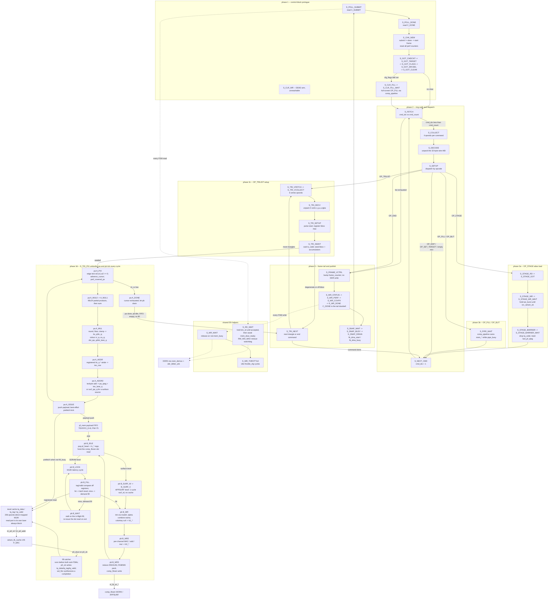

# Code — fabric raster core, `blitter_top.sv` (C4)

**What this answers:** how the **blitter raster core** component named in
`docs/architecture/03-components-fabric.md` is actually built inside one file:
which ports it has and on which bus each one sits, which FSM states exist and
which of them **actually run**, what registers carry a pixel from triangle
setup through the span walk into the pixel backend, how the texel cache is
addressed and filled, and the two structural rules that must never be broken
when this file is edited.

**Scope and provenance.** The file is the **vendored production copy**
`maldita.castilla-mister/fpga/rtl/blitter_top.sv`, pinned `4ef1353`
(milestone-a), with its address/ABI header
`maldita.castilla-mister/fpga/rtl/blitter_defs.vh`. Both are in the synthesized
file list `maldita.castilla-mister/fpga/files.qip`. The module is instantiated
once, as `blitter` in `maldita.castilla-mister/fpga/Maldita.sv:621`. Line
citations are `blitter_top.sv:N` against that pin and will drift; the Sources
section pins the commit.

Container and component names (**blitter raster core**, **scanout reader**,
`comp_pipeline`, `sdram_fb_cache`, `ddr_blitter_arb`, `f2h_slot_mux`, f2h/h2f)
are reused verbatim from `docs/architecture/02-containers.md` and
`docs/architecture/03-components-fabric.md`.

---

## 1. Ports, grouped by bus

`module blitter_top #(parameter AW = 32, parameter [21:0] RW_WD_MAX = 22'h3FFFFF)`
(`blitter_top.sv:35-42`). `RW_WD_MAX` is the `S_RD_WAIT` reissue-watchdog
window and **must stay larger than** `ddr_blitter_arb`'s `FLUSH_QUIET_MAX`
(`:37-41`) — the ordering proof is in the `S_RD_WAIT` comment (`:1895-1905`).

**There is no h2f slave port on this module.** The brief's four-bus grouping
does not map one-to-one: the h2f direction exists only as *the HPS writing DDR3*
(`BLTCTRL` + ring at `0x3B000000`), which this module then reads back over the
**f2h master**. Likewise there are **no video ports** — no pixel clock, no
`VGA_*`. The only video-adjacent signals are the `vs` input and the `dbg`
output. Pixel output belongs to `openbor_video_reader` (see
`03-components-fabric.md` (b)).

| Bus / group | Ports | Line | Notes |
|---|---|---|---|
| clock / reset | `clk`, `rst` | `:43-44` | single `clk_sys` domain; no CDC inside this file |
| framework in | `vs` (scanout vblank), `osd_restart` (`status[19]`), `osd_fps_on` (`status[20]`) | `:45-52` | `vs` is 3-FF synchronized at `:268-271`; `vs_rise` (`:267`) has **no consumer** since the Phase 1 A1 vblank-wait deletion (`:262-266`) |
| **f2h master** (DDR3, qword-addressed, Avalon-MM-ish) | `mem_addr`, `mem_rd`, `mem_wr`, `mem_burstcnt`, `mem_din`, `mem_be` (out); `mem_dout`, `mem_dout_ready`, `mem_busy` (in) | `:56-64` | driven by an **owner mux** (`:2052-2057`): `comp_pipeline`'s `p_mem_*` while `pipe_busy_q`, else the FSM's `bm_*`. FSM traffic is always `burstcnt=8'd1`. At the core top this goes to `vram_demux`, then `ddr_blitter_arb` |
| **SDRAM P_SRC** (read-only cache-ok channel, ch5) | `p0_addr[26:0]`, `p0_rd` (out); `p0_dout[63:0]`, `p0_ok` (in) | `:72-75` | byte address, qword-aligned; one-cycle `p0_rd` pulse, data returns with `p0_ok`. Muxed `tri_busy ? tri_p0_* : p_src_sdram_*` (`:2065-2066`). **No busy/backpressure signal exists on this channel** (`:65-71`) — the single-outstanding discipline is enforced inside this file, see §7 |
| **SDRAM STAGE write** (ch1) | `src_sdram_we`, `src_sdram_din[15:0]` (out, **unconnected at the instantiation**, `Maldita.sv:644-645`); `src_sdram_waddr[26:0]`, `src_sdram_we_burst`, `src_sdram_din64[63:0]` (out); `src_sdram_ok` (in) | `:112-124` | only the **BL=4 burst** variant is live; the three burst outputs are continuously assigned from the STAGE FSM's `stage_*_fsm` regs (`:1992-1994`) |
| SDRAM coherency barrier | `stage_barrier` (out), `stage_barrier_busy` (in) | `:133-134` | commit ch1 + invalidate ch5 between a STAGE and its consuming draw (`:125-132`) |
| **comp_fbram WORK** (on-chip composite target) | `fb_wr_en`, `fb_wr_qw[14:0]`, `fb_wr_lane[1:0]`, `fb_wr_pix[15:0]`, `fb_rd_en`, `fb_rd_qw[14:0]` (out); `fb_rd_qword[63:0]` (in) | `:80-86` | gated off when the composite target is APPSURF (`:2014`, `:2025`) |
| **comp_fbram APPSURF** (off-screen surface) | `surf_wr_en`, `surf_wr_qw`, `surf_wr_lane`, `surf_wr_pix`, `surf_rd_en`, `surf_rd_qw` (out); `surf_rd_qword[63:0]` (in) | `:100-106` | the read port has two mutually exclusive users — the composite RMW read when targeting APPSURF, or the TRILIST surface-texel sample when targeting WORK (`:2027-2033`) |
| WORK→DDR3 copy handshake | `fb_dma_start` (out reg), `fb_dma_busy` (in) | `:94-95` | to `comp_fb_dma`; driven by the `S_SNAP_*` states |
| status / debug | `idle` (out reg, **unconnected**, `Maldita.sv:680`); `dbg[31:0]` (out) | `:139`, `:147` | `dbg = {dbg_stuck[23:16], rd_issued, rd_reissue_cnt, 9'd0, state}` (`:365`); wired to `blt_dbg_live` and republished by the scanout reader's beacon |

---

## 2. Stage / dataflow structure



---

## 3. Main FSM state table

All states are 6-bit `localparam`s declared at `blitter_top.sv:149-198`; the
single `case (state)` runs `:1044-1936`. **Live** means the state has a
reachable case arm.

| State (enc.) | Live | Line | Role | Key signals |
|---|---|---|---|---|
| `S_POLL_SUBMIT` (0) | live | `:1045` | idle poll: read `C_SUBMIT` | `idle<=1`, `bm_addr=BLTCTRL_QW+C_SUBMIT`, `rd_ret` |
| `S_POLL_DONE` (1) | live | `:1049` | latch submit, read `C_DONE` | `submit_reg` |
| `S_CHK_NEW` (2) | live | `:1054` | frame start when `done != submit`; per-frame resets | `done_reg`, `idle<=0`, `comp_target<=WORK`, all `perf_*<=0` |
| `S_GOT_CMDCNT` (3) | live | `:1066` | latch command count | `cmd_count` |
| `S_GOT_TARGET` (4) | live | `:1071` | latch display buffer | `target_buf`, `target_base` (`FB0_QW`/`FB1_QW`) |
| `S_GOT_FLAGS` (5) | live | `:1080` | latch frame flags | `cfg_flags` |
| `S_GOT_SRCSEL` (30) | live | `:1088` | latch throttle + ring select | `throttle_cfg=[15:8]`, `ring_sel=[C_RINGSEL_BIT]`; bits 0/1 dead |
| `S_GOT_CLEAR` (6) | live | `:1101` | latch clear colour; synthesize a full-screen `OP_FILL` when `cfg_flags[0]` | `clear_color`, `c_*` overwritten |
| `S_CLR_FILL` (12) | live | `:1126` | dispatch the clear FILL | `pipe_start` |
| `S_CLR_FILL_WAIT` (13) | live | `:1130` | wait for the clear to complete | `p_blit_done` |
| `S_CLR_WR` (7) | **dead** | `:1134` | old `bm_*` SDRAM clear loop; arm exists but is unreachable, kept so `wr_ret` references resolve (`:1133`) | `clr_idx` (never advances) |
| `S_FETCH` (8) | live | `:1144` | fetch command `cmd_idx` qword 0, or end the list | `ring_base + cmd_idx*4`, `fetch_k` |
| `S_COLLECT` (9) | live | `:1151` | collect qwords 1..3 | `cmd_qw[0:3]`, `fetch_k` |
| `S_DECODE` (10) | live | `:1159` | unpack the 32-byte wire ABI incl. the RGB888 tint | `c_opcode`…`c_cmod_b` |
| `S_SETUP` (11) | live | `:1188` | opcode dispatch | `tri_busy`, `tri_count`, `tri_entry_qw`, `tri_src_surface`, `comp_target`, `stage_*`, `pipe_start` |
| `S_STAGE_RD` (32) | live | `:1239` | DDR3 beat read at `SRC_QW + (off+stage_byte)>>3` | `bm_addr`, `stage_byte` |
| `S_STAGE_GOT` (33) | live | `:1248` | capture the beat | `stage_beat` |
| `S_STAGE_WR` (34) | live | `:1254` | issue one BL=4 SDRAM burst write | `stage_waddr_fsm`, `stage_din64_fsm`, `stage_we_burst_fsm` |
| `S_STAGE_WR_WAIT` (35) | live | `:1266` | hold the burst until the cache accepts | `src_sdram_ok`, re-asserts `stage_we_burst_fsm` |
| `S_STAGE_BARRIER` (38) | live | `:1284` | pulse the ch1→ch5 barrier; **drop the texel cache** | `stage_barrier`, `tq_valid<=0`, `last_pf_qtag<=24'hFFFFFF` |
| `S_STAGE_BARRIER_WAIT` (39) | live | `:1296` | release on the busy **falling** edge | `barrier_seen_busy` |
| `S_PIPE_WAIT` (37) | live | `:1774` | FILL/BLIT handed to `comp_pipeline` | `p_blit_done`; `bm_*` idle, `pipe_busy` owns `mem_*` |
| `S_TRI_VFETCH` (45) | live | `:1306` | read vertex qword 0 of triangle `tri_idx` | `tri_vbase = tri_entry_qw + tri_idx*6` |
| `S_TRI_VCOLLECT` (46) | live | `:1313` | collect 6 vertex qwords | `tri_vqw[0:5]`, `tri_vk` |
| `S_TRI_DECV` (47) | live | `:1326` | unpack 3 vertices (x,y s12.4; u,v u12.4; rgba 8b) | `tri_vx0`…`tri_va2` |
| `S_TRI_SETUP` (48) | live | `:1349` | pulse `blt_tri_setup.start`; **pre-register** the clamped bbox max | `tri_setup_start`, `tri_maxx<=tri_maxx_cl`, `tri_maxy<=tri_maxy_cl` |
| `S_TRI_SWAIT` (49) | live | `:1356` | on `ts_valid`, seed the walk or skip a degenerate/off-bbox triangle | `tri_ox/px/py`, `tri_cv`, `w0..w2`, `row_w*`, `Wu..Wa`, `row_W*`, `pa<=A_PIX`, `pb<=B_IDLE`, FIFO pointers cleared |
| `S_TRI_PIX` (50) | live | `:1381` | **umbrella**: fill catcher + `pa` + `pb` tick every cycle until the walk drains | `fill_busy`, `p0_ok`, `wd_fire`, `pa`, `pb`, `pf_*` |
| `S_TRI_NEXT` (56) | live | `:1759` | next triangle, else end the command | `tri_idx`, `tri_busy<=0` |
| `S_NEXT_CMD` (19) | live | `:1769` | advance the ring index | `cmd_idx` |
| `S_FRAME_VCTRL` (20) | live | `:1776` | bump `frame_counter`; **writes no DDR** (`comp_fb_dma` is the sole control-word producer) | `frame_counter` |
| `S_WR_STATUS` (22) | live | `:1818` | publish `C_STATUS`: low = OSD mirror + `wd_fire_count`, high = `perf_texwait_cyc` | `bm_be=0xFF`, `osd_restart_pending` cleared |
| `S_WR_PERF` (25) | live | `:1836` | publish `perf_tri_cyc` to `C_SRCSEL.hi`, `be=0xF0` | `wr_ret<=S_WR_COVPX` |
| `S_WR_COVPX` (31) | live | `:1796` | publish `perf_covered_px` to `C_FLAGS.hi`, `be=0xF0` | `wr_ret<=S_WR_DONE` |
| `S_WR_DONE` (21) | live | `:1802` | **release barrier, written last**: `C_DONE` = `{perf_frame_cyc, submit_reg}` | `bm_be=0xFF`, `wr_ret<=S_SNAP_WAIT` |
| `S_SNAP_WAIT` (42) | live | `:1879` | unconditional pass-through; pulse the WORK→DDR3 copy | `fb_dma_start`, `snap_guard<=0` |
| `S_SNAP_BUSY` (43) | live | `:1883` | wait for `fb_dma_busy`, bounded by `SNAP_GUARD=32` | `snap_guard` |
| `S_SNAP_DRAIN` (44) | live | `:1889` | hold until the copy completes | `fb_dma_busy` |
| `S_RD_WAIT` (23) | live | `:1906` | shared read helper: hold `bm_rd` until accepted, then await `mem_dout_ready`; reissue on `RW_WD_MAX` | `rd_issued`, `rw_wd`, `rd_reissue_cnt`, `rd_data`, `rd_ret` |
| `S_WR_WAIT` (24) | live | `:1921` | shared write helper: release on `!mem_busy` | `bm_wr`, `bm_be`, `throttle_cnt`, `wr_ret` |
| `S_WR_THROTTLE` (36) | live | `:1932` | idle `throttle_cfg` cycles so the reader can refill | `throttle_cnt` |
| `S_TRI_GOTTEX` (51) | **dead** | decl `:183` | replaced by `pb` `B_LOOK`/`B_FILL`/`B_WAIT` | — |
| `S_TRI_DSTW` (52) | **dead** | decl `:184` | dst read hoisted into `B_IDLE` | — |
| `S_TRI_DSTC` (53) | **dead** | decl `:185` | as above | — |
| `S_TRI_WR` (54) | **dead** | decl `:186` | now `pb` `B_WR` | — |
| `S_TRI_ADV` (55) | **dead** | decl `:187` | now the `advance_cursor` task (`:954-977`) called at dispatch | — |
| `S_TRI_MUL` (57) | **dead** | decl `:189` | now `pa` `A_MUL` | — |
| `S_TRI_WR2` (58) | **dead** | decl `:193` | now `pb` `B_WR2` | — |
| `S_TRI_WR3` (59) | **dead** | decl `:194` | now `pb` `B_WR3` | — |
| `S_TRI_ADDR` (60) | **dead** | decl `:195` | now `pa` `A_ADDR` | — |
| `S_TRI_MUL0` (61) | **dead** | decl `:196` | now `pa` `A_MUL0` | — |
| `S_TRI_ADDR2` (62) | **dead** | decl `:197` | now `pa` `A_ADDR2` | — |
| `S_TRI_MUL1` (63) | **dead** | decl `:198` | now `pa` `A_MUL1` | — |

Verified by grep: each of the twelve dead `S_TRI_*` names appears **only** on
its own `localparam` line and in prose comments — never as a `case` arm and
never on the right-hand side of a `state <=` assignment. `S_CLR_WR` is the one
dead state that still has an arm.

**Two naming traps carried forward from `03-components-fabric.md`:**

- **`S_TRI_RUN` does not exist.** It appears only in comments (`:487`,
  `:1374`) as the intended name of the umbrella state. The declared umbrella
  state is `S_TRI_PIX = 6'd50`.
- **`perf_texwait_cyc`'s declaration comment is stale.** It says "cycles
  blocked in `S_TRI_GOTTEX`" (`:310`), naming a dead state. The code counts
  `(state==S_TRI_PIX) && (pb==B_WAIT)` (`:1029-1030`). Code is truth.

Encodings `6'd14`–`6'd18`, `6'd26`–`6'd29`, `6'd40`, `6'd41` are unassigned
(retired; `:171` notes the `dst_barrier` pair). The `default:` arm returns to
`S_POLL_SUBMIT` (`:1935`).

### `pa` — address-generation sub-FSM

3-bit, declared `blitter_top.sv:497-498`; register `pa` at `:520`; case at
`:1404-1561`. All arms are live.

| State (enc.) | Line | Role | Key signals |
|---|---|---|---|
| `A_PIX` (0) | `:1409` | edge test `w0,w1,w2 >= 0`; on cover, snapshot the pixel and latch multiply operands; **always** advance the cursor | `pxs`, `pys`, `wu_q`…`wa_q`, `recip_q`, `advance_cursor`, `perf_covered_px`, `tri_cv` |
| `A_MUL0` (1) | `:1433` | twelve 48×24 partial products (`recip` split into halves) | `pp_u_lo`…`pp_a_hi` |
| `A_MUL1` (2) | `:1444` | recombine `pp_lo + (pp_hi<<24)` — bit-exact `W*recip` | `mul_u`…`mul_a` |
| `A_MUL` (3) | `:1458` | round `>>>40`, **floor** `>>>4` (not `+8` round), clamp to `tex_w/h` or the fixed surface extent; interpolated colour; destination qword/lane | `rnd_*`, `itu`/`itv`, `itu_q`/`itv_q`, `tw1r`/`th1r`, `cr_q`…`ca_q`, `dst_qw_q`, `dst_lane_q` |
| `A_ADDR` (4) | `:1499` | registered 16×16 texel-row multiply | `tex_row <= itv_q * (surface ? FB_STRIDE_QW16 : c_src_stride)` |
| `A_ADDR2` (5) | `:1509` | adds only: SDRAM byte address → qword tag + lane, or the surface qword | `texbyte`, `pa_qtag`, `tex_lane_q`, `surf_qw_q` |
| `A_ISSUE` (6) | `:1533` | stall on `pf_full`; push the payload; best-effort prefetch kick | `pf_mem`, `pf_wr`, `tri_p0_rd/addr`, `fill_busy/slot/tag`, `last_pf_qtag` |
| `A_DONE` (7) | `:1559` | cursor exhausted; idle while `pb` drains | — |

### `pb` — consume-and-blend sub-FSM

4-bit, declared `blitter_top.sv:515-519`; register `pb` at `:521`; case at
`:1564-1751`. All arms are live. **Encodings 4 and 5 are a hole** — the deleted
`B_DSTW`/`B_DSTC` (`:503-504`); raw `pb` values are decoded by eye from device
wedge-probe dumps, so renumbering silently reinterprets historical probe data
(`:512-514`).

| State (enc.) | Line | Role | Key signals |
|---|---|---|---|
| `B_IDLE` (0) | `:1579` | pop `pf_head` into the B-local copies; **hoist** the `comp_fbram` dst read (read straight off `pf_head`, since `b_dst_qw` is not valid until end of cycle) | `b_cr/cg/cb/ca`, `b_dst_qw`, `b_dst_lane`, `b_qtag`, `b_tex_lane`, `pf_rd`, `tri_fb_rd_en`, `tri_surf_rd_en` |
| `B_LOOK` (1) | `:1611` | the M10K latency cycle — the read itself is **not** here (§7 rule b) | `tq_rdata`, `tq_rtag`, `tq_rvalid` become valid |
| `B_FILL` (2) | `:1615` | hit/miss decided off the registered snapshot; hit latches texel + dst, miss issues a demand fill | `tq_rdw_bad`, `tq_rvalid`, `tq_rtag`, `texel_q`, `dst_q`, `tri_p0_rd/addr`, `fill_*` |
| `B_WAIT` (3) | `:1657` | stall on the in-flight fill; **re-issue the dst read on the exit edge**, not in the miss branch (`:1642-1656`) | `fill_busy`, `tri_fb_rd_en`, `tri_fb_rd_qw` |
| `B_WR` (6) | `:1668` | stage A: tint via `modch`, split dst channels, alpha combine `ea/na`, colorkey cull | `b1_tsr/tsg/tsb`, `b1_dr/dg/db`, `b1_ea`, `b1_na`, `b1_we`, `xa_t`, `ea_t` |
| `B_WR2` (7) | `:1694` | stage B: per-channel MAC (`ALPHA`), pre-sum (`ADD`), product (`MULTIPLY`), or pass-through | `b2_r/g/b`, `b2_we` |
| `B_WR3` (8) | `:1723` | stage C: `red255`/`red31`/`red63` or saturate, RGB565 pack, `comp_fbram` write | `bl_or/og/ob`, `tri_fb_wr_en/qw/lane/pix` |
| `B_SURF_W` (9) | `:1596` | APPSURF texel path: the 1-cycle `surf_rd` BRAM latency | — |
| `B_SURF_C` (10) | `:1600` | latch the surface texel + dst, then blend (mirrors the `B_FILL` hit tail) | `texel_q`, `dst_q` |

The triangle is done when `pa==A_DONE && pb==B_IDLE && pf_empty && !fill_busy`
(`:1755-1756`).

---

## 4. Pipeline registers: setup → span walk → pixel backend

Three register boundaries carry a pixel across the datapath.

**(a) `blt_tri_setup` → walk (per triangle).** `blt_tri_setup #(.SHIFT(40))
u_tri_setup` (`:857-872`) publishes registered outputs that stay stable from
`valid` until the next `start`: `ts_area`, `ts_area_recip`, `ts_ox`/`ts_oy`,
`ts_w{0,1,2}_0`, `ts_dw{0,1,2}d{x,y}`, `ts_W{u,v,r,g,b,a}_0`,
`ts_dW*d{x,y}`, `ts_degenerate` (declared `:848-855`). `S_TRI_SWAIT` copies the
seeds into the walk's own accumulators — `w0/w1/w2` (64-bit, `:462`),
`row_w0/1/2` (`:463`), `Wu…Wa` and `row_Wu…row_Wa` (**48-bit**, deliberately not
64, to keep the per-pixel multiply a 48×48 rather than 64×48, `:464-470`). The
delta wires `ts_dW*` are read directly by `advance_cursor` (`:954-977`); they
are never copied.

**(b) Walk cursor → datapath (stage-1 decoupling).** `A_PIX` advances
`(tri_px, tri_py)` and every accumulator **at dispatch**, then hands the
datapath a snapshot in `pxs`/`pys` (`:460`, `:1413`) so the cursor can move on
while pixel N is still in flight. `tri_cv` (`:459`) marks the cursor as still
inside the bbox. The multiply operands cross into single-fanout regs
`wu_q…wa_q` + `recip_q` (`:812-813`) precisely so Quartus can absorb them as
the DSP input register — `Wu…Wa` themselves fan out to accumulate + compare +
multiply and cannot be (`:805-811`).

**(c) `pa` → `pb` (the payload FIFO — the real handoff).** `pf_mem`
(`:531`), depth `TEXFIFO_D = 8`, width `PW = 32+15+2+24+2 = 75` (`:528-530`).
Pointers `pf_wr`/`pf_rd` carry an extra MSB for full/empty disambiguation;
`pf_empty`/`pf_full`/`pf_head` at `:533-535`. Payload packing, LSB up
(`:1552-1554` push, `:1580` pop — **the two must stay in sync**):

```
{ ca, cb, cg, cr,  dst_qw[14:0], dst_lane[1:0], qtag[23:0], texlane[1:0] }
   bit  74..43        42..28         27..26         25..2        1..0
```

`pb` works from **B-local copies** `b_cr/b_cg/b_cb/b_ca/b_dst_qw/b_dst_lane/
b_qtag/b_tex_lane` (`:545-549`), never the live `pa` registers, because `pa`
may already be overwriting `cr_q`/`dst_qw_q`/… for pixel N+1 (`:542-544`,
`:492-496`). Triangle constants (`c_blend`, `c_alpha`, `c_src_*`,
`tri_need_dst`) need no snapshot: the pipe drains before the next triangle's
setup (`:494-496`).

One pipeline register is explicitly **pa-private** and must not be folded away:
`pa_qtag` (`:480`) carries the texel qword tag from `A_ADDR2` to `A_ISSUE`.
Reusing `tri_p0_addr` for that hand-carry was a real defect — `pb`'s `B_FILL`
demand-miss writes `tri_p0_addr` from the same always block and clobbers `pa`'s
in-flight address on a same-cycle collision or during any `pf_full` stall
(`:476-479`, `:1528-1532`, `:1541-1542`).

**(d) Blend stages inside `pb`.** `b1_*` (stage A, `:836-838`), `b2_*`
(stage B, `:839-840`); `c_blend`/`c_colorkey`/`b_dst_qw`/`b_dst_lane` are
stable across all three and are used directly rather than re-registered
(`:834-835`). The arithmetic is byte-identical to `blt_blend.sv` — which is
compiled (`files.qip`) but **instantiated nowhere**; the logic was hand-inlined
here for timing (`:874-882`).

---

## 5. Texel cache interface

Declared `blitter_top.sv:563-646`. Direct-mapped, `TEXQ_N = 256` qwords,
`TEXQ_AW = 8`, `TEXQ_TW = 24 - TEXQ_AW = 16` (`:572-574`). A 24-bit `qtag`
(the SDRAM byte address `>>3`) splits as slot = `qtag[7:0]`, tag = `qtag[23:8]`.

| Element | Line | Contract |
|---|---|---|
| `tq_data [0:255]` `[63:0]` | `:593` | `(* ramstyle = "no_rw_check, M10K" *)`; written **only** by the catcher |
| `tq_tag [0:255]` `[15:0]` | `:594` | same attribute; written only by the catcher |
| `tq_valid [255:0]` | `:595` | packed **flops**, not BRAM — it needs the 1-cycle synchronous bulk clear at the STAGE barrier (`:1289`) |
| read port | `:634-638` | its own bare `always @(posedge clk)`, no reset, no condition; produces `tq_rdata`/`tq_rtag`/`tq_rvalid` from `b_qtag[7:0]` |
| `tq_rdw_bad` | `:643-645` | separate block (carries reset). Set when the snapshot cycle collided with a same-slot catcher write; forces `B_FILL` down the miss path, because `no_rw_check` makes that read **undefined** (`:601-608`) |
| fill arbiter | `:615-618` | `fill_busy` / `fill_slot` / `fill_tag`: **single outstanding**, sole owner of `tri_p0_rd` / `tri_p0_addr` |
| catcher | `:1388-1392` | always-listening at the top of `S_TRI_PIX`; on `fill_busy && p0_ok` writes `tq_data[fill_slot]`, `tq_tag[fill_slot]`, sets `tq_valid`, clears `fill_busy`. `p0_ok` is a 1-cycle strobe, so it cannot be waited for inside `pb` (`:536-541`) |
| fill watchdog | `:621-624`, `:1393-1402` | `wd_stall` counts continuous `fill_busy && !p0_ok`; at `WD_TIMEOUT = 4096` (~42 µs) `wd_fire` synthesizes a completion with **stale** `tq_data` (tag/valid stamped, data left unwritten) so `pb` makes forward progress instead of hanging. `wd_fire_count` is published in `C_STATUS` low bits (`:1831`) |
| prefetch de-dup | `:610-614`, `:1543-1550` | `last_pf_qtag` skips re-issuing the qword `pa` just prefetched. It is **not** a residency check — `pb`'s `B_LOOK`/`B_FILL` demand path is the correctness backbone, so a missed skip costs a redundant fill, never a wrong texel |
| invalidation | `:1287-1290` | the whole cache is dropped **per command**, at `S_STAGE_BARRIER`, exactly when `sdram_fb_cache` ch5 is invalidated |

`pa` deliberately **does not read the tag RAM** — that is what lets `tq_tag`
stay a single-reader M10K (`:576-581`, `:1536-1538`). The APPSURF texel path
bypasses the cache and P_SRC entirely (`:556-561`, `B_SURF_W`/`B_SURF_C`).

---

## 6. Perf counters

`perf_frame_cyc`, `perf_pipe_cyc` (`:307`), `perf_tri_cyc`,
`perf_texwait_cyc` (`:314`), `perf_covered_px` (`:322`). Accumulated at
`:1016-1031` under `if (!idle)`; all reset at `S_CHK_NEW` (`:1061-1063`).
`perf_tri_cyc` uses the encoding trick `state >= S_TRI_VFETCH` (`:1022`) — this
is why the TRILIST states occupy the top of the 6-bit space, and why
renumbering them would silently change the counter's meaning.
`perf_covered_px` increments at **dispatch** in `A_PIX` (`:1423`), where
coverage is decided, not at retire.

---

## 7. Two rules that must never be violated

### (a) The f2h consumer is poll-before-issue

**Where the rule lives (the reader).** `openbor_video_reader` is the f2h
arbiter's **default owner**; it must never assert a request into a busy slot.
Every state that drives `ddr_rd`/`ddr_we` is guarded by `if (!ddr_busy)`, and
the model is stated in as many words at
`maldita.castilla-mister/fpga/rtl/openbor_video_reader.sv:822-824`: *"gate on
`!ddr_busy` so we only ask when the rdr slot is free (arbiter default-owner
model)"*, with the gate itself at `:825`. A held request is dropped only once
accepted (`:474-475`). Asserting on ownership rather than on a free slot is a
silent livelock — the A1 corruption-lines fault.

**Where the rule lives inside `blitter_top.sv`.** This module is the arbiter's
**borrower** (m1), not the default owner, so its f2h form is *hold-until-
accepted* rather than *ask-only-when-free*: `S_RD_WAIT` holds `bm_rd` and only
sets `rd_issued` on `if (!mem_busy)` (`:1907-1909`); `S_WR_WAIT` releases
`bm_wr` only on `if (!mem_busy)` (`:1921`); `S_STAGE_WR_WAIT` re-asserts
`stage_we_burst_fsm` until `src_sdram_ok` (`:1266-1277`). Never convert any of
these to a fire-and-forget pulse.

The same discipline appears in its strictest form on the **P_SRC channel**,
which has *no busy signal at all* (`:65-71`) and is single-outstanding. The
"slot busy" state is `fill_busy`, and both issue sites are gated on it:

- `pa` prefetch — `if (!tri_src_surface && (pa_qtag != last_pf_qtag) && !fill_busy)` (`:1543`)
- `pb` demand fill — `if (!fill_busy)` (`:1625`)

Issuing a second `p0_rd` while `fill_busy` would leave `fill_slot`/`fill_tag`
pointing at the wrong fill and stamp a valid tag onto the wrong qword. Only
these two sites may write `tri_p0_rd`/`tri_p0_addr`.

### (b) A `ramstyle` array's read must never be nested in an FSM case arm

`tq_data` and `tq_tag` are `(* ramstyle = "no_rw_check, M10K" *)` (`:593-594`).
Their read lives in its **own unconditional `always @(posedge clk)` block** at
`blitter_top.sv:634-638` — deliberately not inside `B_LOOK` or any other case
arm. That block carries **no reset**, on purpose: adding one risks pushing the
read back into LABs, which is the exact bug being avoided (`:639-642`).

What nesting it cost, recorded in the declaration comment (`:583-592`): Quartus
17.0 reported both arrays "uninferred due to asynchronous read logic"
(`map.rpt` **Info 276007**) and built them from LABs — 256×64 + 256×16 =
**20,480 stray flops**, ~45% of the design's registers; `b_qtag[7:0]` became the
top non-global fan-out net (~1,735) driving a real 256:1 distributed mux; worst
setup slack **−0.983 ns** on the fabric clock over a single 9.565 ns route with
no logic in it. Writes inside a case arm are fine — the catcher writes from
inside `S_TRI_PIX` (`:1389-1391`). **Only the read position matters.**

Enforcement, both binding:

- **CI:** `maldita.castilla-mister/scripts/tests/test_ast_grep_ramstyle.sh`,
  run by the gating `ramstyle-gate` job in
  `maldita.castilla-mister/.github/workflows/ast-grep.yml`. It extracts the
  `ramstyle`-annotated array names per file and generates the rule, so a newly
  added array is covered automatically. Whole-tree scope, currently at zero
  findings. Do not bypass it.
- **Post-synthesis:** `grep 276007 *.map.rpt` on every build; expect no new
  uninference warnings (the recorded steady state is a single known `xq_mem`
  case).

---

## Verified during the review pass

- **`RW_WD_MAX` > `FLUSH_QUIET_MAX` — the ordering holds in the shipping
  build.** `ddr_blitter_arb`'s `FLUSH_QUIET_MAX` defaults to `20'hFFFFF`
  (2^20−1, "~10.6 ms @ 98.4375 MHz",
  `maldita.castilla-mister/fpga/rtl/ddr_blitter_arb.sv:49`) and its
  instantiation passes only `#(.ENABLE(1'b1))`
  (`maldita.castilla-mister/fpga/Maldita.sv:749`). `blitter_top` is
  instantiated as a bare `blitter_top blitter` with **no** parameter override
  (`Maldita.sv:621`), so `RW_WD_MAX` keeps its `22'h3FFFFF` default (2^22−1).
  2^22−1 > 2^20−1, so a reissued read can never pair with a stale
  expectation-queue entry.
- **`SOLARUS_DBG_PROBES` is not defined in the shipping build**, so the state
  table above (which describes the non-`ifdef` `else` branches) is the shipping
  behaviour. `maldita.castilla-mister/fpga/Maldita.qsf` carries exactly four
  `VERILOG_MACRO` assignments — `MENU_CORE`, `MALDITA_CORE`,
  `MISTER_DISABLE_PALETTE1`, `MISTER_DISABLE_ALSA` (`:11,12,19,29`) — and `:31`
  is a standing comment *"do NOT re-enable SOLARUS_DBG_PROBES ..."*. No
  `` `define SOLARUS_DBG_PROBES `` exists anywhere under `fpga/`. The
  wedge-probe block (`:648-722`) and the `ifdef` branches in
  `S_WR_STATUS`/`S_WR_PERF` (`:1826-1847`) are therefore all compiled out.
- **The host never emits `C_TARGET == 2`.** `blt_emitter.c:81` clamps
  `e->target_buf` to 0/1/2 and is the only assignment to it; the only
  `blt_begin_frame()` call on the shipping path passes `target_buf=0`
  (`external/gmloader-next/gmloader/mister/raster_backend_mfgpu.cpp:1241`), and
  `mf_device_publish` writes that value straight through (`:947`). So
  `CACHE_QW` / `C_TARGET==2` (`blitter_defs.vh:66`) is dead on both sides, not
  just in this file.

## Unverified

- **`sim` guards.** The `ifndef SYNTHESIS` A2-DSTALE assertion block
  (`:726-803`) is documented as sim-only. `Maldita.qsf` defines no `SYNTHESIS`
  macro of its own (checked), so the guard relies on Quartus's implicit
  `SYNTHESIS` define; that implicit behaviour was not confirmed against a build
  here. **Unverified** — a `*.map.rpt` from a real Quartus run would settle it.
- **DSP/M10K resource outcome.** The pipelining rationale throughout (`:805-
  811`, `:1493-1498`) is quoted from in-source STA notes. No fitter report was
  read for this doc. **Unverified**.
- **`blitter_defs.vh` byte addresses vs the host.** `RING_QW`, `RING_B_QW`,
  `SRC_QW`, and the `C_*` offsets are quoted from the header
  (`blitter_defs.vh:52-104`). The **register-index** half of that agreement is
  cross-verified word by word in `docs/architecture/05-data-flows.md` §3; the
  **base/heap byte addresses** were not re-derived against `gmloader-next` in
  this doc — `docs/architecture/03-components-libmfgpu.md` covers the host side.

## Sources

- `maldita.castilla-mister/fpga/rtl/blitter_top.sv` — read in full (2082
  lines). Module + parameters (`:35-42`), port list (`:43-148`), main state
  `localparam`s (`:149-198`), opcode/blend/flag constants (`:200-220`), FSM
  registers (`:222-231`), `comp_pipeline` routing regs (`:232-243`), `vs`
  synchronizer (`:251`, `:267-271`), throttle + ring select (`:282-295`), perf
  counters (`:298-322`), command decode registers (`:341-346`), `dbg` snapshot
  (`:348-365`), OSD restart latch (`:369-390`), STAGE registers (`:392-412`),
  `src_in_sdram` (`:420`), clip (`:422-429`), TRILIST registers (`:437-483`),
  `pa` encoding (`:497-498`), `pb` encoding + the 4/5 hole (`:499-519`),
  payload FIFO (`:523-535`), B-local copies (`:542-549`), tri bus-owner regs
  (`:551-561`), texel cache (`:563-646`), wedge probe (`:648-722`), sim
  assertions (`:726-803`), multiply pipeline regs (`:805-828`), blend stage
  regs (`:830-845`), `blt_tri_setup` instance (`:847-872`), blend functions
  (`:874-924`), bbox clamp (`:926-946`), `advance_cursor` (`:948-977`), main
  always block (`:979-1938`), perf accumulation (`:1016-1031`), main case
  (`:1044-1936`), `pa` case (`:1404-1561`), `pb` case (`:1564-1751`), triangle
  drain (`:1755-1756`), `comp_pipeline u_pipe` (`:1947-1979`), STAGE burst
  assigns (`:1992-1994`), composite target routing (`:1996-2038`), `mem_*`
  owner mux (`:2040-2057`), `p0_*` source mux (`:2059-2066`), `pipe_busy`
  bookkeeping (`:2068-2080`).
- `maldita.castilla-mister/fpga/rtl/blitter_defs.vh` — geometry
  (`:23-28`), framebuffer/control addresses (`:30-33`), ring A/B + heap
  (`:52-59`), control-block offsets (`:69-104`), command-ABI mirror
  (`:106-140`).
- `maldita.castilla-mister/fpga/Maldita.sv` — `blitter_top blitter`
  instantiation and per-port wiring (`:621-682`), including the unconnected
  `src_sdram_we`/`src_sdram_din` (`:644-645`) and `idle` (`:680`), and
  `dbg -> blt_dbg_live` (`:681`).
- `maldita.castilla-mister/fpga/rtl/openbor_video_reader.sv` — poll-before-
  issue: the `ST_READ_LINE` statement of the model (`:822-824`), the gate
  (`:825`), and drop-once-accepted (`:474-475`).
- `maldita.castilla-mister/fpga/rtl/ddr_blitter_arb.sv` — default-owner /
  borrower model and the exact-beat-ownership rationale (`:1-40`),
  `FLUSH_QUIET_MAX` default (`:49`).
- `maldita.castilla-mister/fpga/Maldita.qsf` — the shipping build's complete
  `VERILOG_MACRO` set (`:11,12,19,29`) and the standing
  do-not-re-enable-`SOLARUS_DBG_PROBES` note (`:31`).
- `external/gmloader-next/3rdparty/mfgpu/host/blt_emitter.c` — `target_buf`
  clamp (`:81`), the host side of the dead `C_TARGET==2` path. Pin:
  `external/gmloader-next` = `d585b38` (`3rdparty/mfgpu` submodule = `9ccd57a`).
- `maldita.castilla-mister/fpga/rtl/blt_tri_setup.sv` — the per-triangle setup
  block instantiated at `blitter_top.sv:857`.
- `maldita.castilla-mister/fpga/rtl/blt_blend.sv` — compiled, instantiated
  nowhere; the inlined `B_WR*` arithmetic is byte-identical to it.
- `maldita.castilla-mister/fpga/rtl/blt_tri.sv` — sim-only golden reference,
  not in the synthesized file list.
- `maldita.castilla-mister/fpga/files.qip` — the authoritative synthesized file
  list.
- `maldita.castilla-mister/scripts/tests/test_ast_grep_ramstyle.sh` — the M10K
  inference gate; its header (`:1-25`) records the defect class and the
  measured cost.
- `maldita.castilla-mister/.github/workflows/ast-grep.yml` — the gating
  `ramstyle-gate` job (`:45-61`).
- `maldita.castilla-mister/rules/hdl-lint.yaml` — the sibling HDL lint rules
  and the note on why the ramstyle check cannot be a plain rule entry (`:12`).
- `docs/architecture/02-containers.md` — container names, the `0x3B` address
  map, and f2h/h2f terminology, reused verbatim.
- `docs/architecture/03-components-fabric.md` — component names, the
  live-vs-dead state inventory, and the `pa`/`pb` encoding-stability note that
  this doc expands.

Repo pins: `maldita.castilla-mister` = `4ef1353` (milestone-a);
`external/gmloader-next` = `d585b38` (its `3rdparty/mfgpu` submodule =
`9ccd57a`), cited only for the host half of the dead `C_TARGET==2` path.
