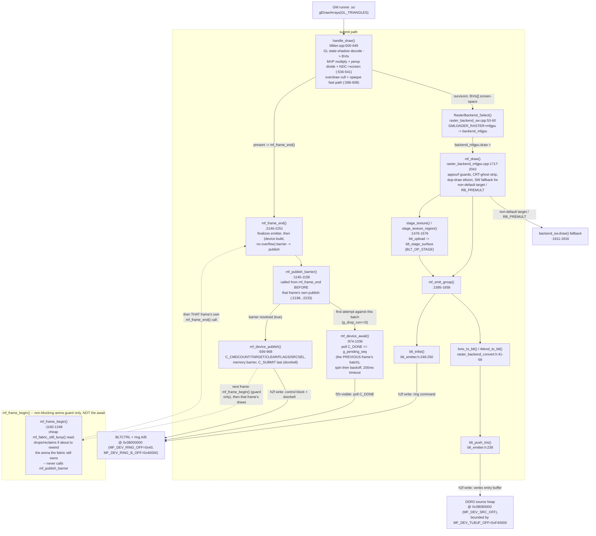

# Code — host render pipeline, `handle_draw` → fabric submit/poll (C4)

**What this answers:** how a GameMaker `glDrawArrays(GL_TRIANGLES)` call
actually becomes a `BLT_OP_TRILIST` command in the fabric's ring and a
`C_SUBMIT`/`C_DONE` handshake on the shipping (`GMLOADER_RASTER=mfgpu`) host
path — real function names, real signatures, real line numbers — down to the
per-vertex fixed-point packing and the control-block register writes. It also
records, briefly, why the `libmfgpu` public API named in the Task 8 brief
(`mfgpu_submit_batch()` etc.) is **not** part of that path.

**Scope and provenance.** Primary subject is the code that actually runs when
Maldita Castilla draws with the fabric backend selected: `blitter.cpp`'s
`handle_draw()` → `raster_backend_mfgpu.cpp`'s `mf_draw()` → `mf_emit_group()`
→ the pure converters in `raster_backend_convert.h` → the emitter
(`3rdparty/mfgpu/host/blt_emitter.h`) → the device-transport pair
`mf_device_publish()`/`mf_device_await()`. All of it lives in the
`gmloader-next` superproject and its vendored `3rdparty/mfgpu/host` +
`3rdparty/mfgpu/refmodel` headers, **not** in `3rdparty/mfgpu/libmfgpu`
(that front-end is covered only in the short section at the end). This doc
narrows and re-verifies `docs/architecture/03-components-libmfgpu.md`'s
pipeline diagram to file:line citations; where this doc's tracing surfaces a
level of ordering/timing detail C3's diagram does not show (the barrier's
placement and its one-frame deferral, §1), it is called out as a refinement,
not a correction — C3's own call-site placement checks out.

Component/container names (**libmfgpu**, **backend seam**, `BLTCTRL`, f2h/h2f,
the `0x3B` address map) are reused verbatim from `02-containers.md` and
`03-components-libmfgpu.md`.

---

## 1. Call graph



**Refinement of `03-components-libmfgpu.md`'s diagram — not a deviation.**
C3's diagram already places the await correctly: `FrameEnd --> Await` (both
under `mf_frame_end`), and this doc's tracing confirms that call site —
`mf_publish_barrier()` (which calls `mf_device_await()` at `:1152`) is called
**only** from `mf_frame_end()`, at `:2198` (device branch) and `:2233`
(host-oracle branch); `grep -n "mf_publish_barrier" raster_backend_mfgpu.cpp`
shows no call site inside `mf_frame_begin()` (`:1160-1248`) at all — that
function's own comment at `:1165` states the blocking wait "MOVED OUT of
here, to mf_publish_barrier". What C3's diagram does not show, and this doc
adds: **the await runs BEFORE that frame's own publish, and it resolves the
PREVIOUS frame's batch, not the current one.** Concretely, in steady state,
frame N's `mf_frame_end()` first calls `mf_publish_barrier()` — which awaits
whatever batch frame N-1 published — and only after that barrier resolves
does it call `mf_device_publish()` for frame N's own batch (`:2194-2207`,
device branch; `:2233-2237`, host-oracle branch, same order). This is the
"Phase 2 host lever" pipelining: because the wait for frame N-1 is deferred
from immediately-after-N-1's-publish to the start of N's `mf_frame_end`, all
of frame N's draw emission (`mf_draw`/`mf_emit_group`, run between N's
`mf_frame_begin()` and its `mf_frame_end()`) overlaps the fabric still
rasterizing N-1, per the code comment at `:1169-1172`. `mf_frame_begin()`
itself only does a **non-blocking** `mf_fabric_still_busy()` read (a cheap
register poll, not `mf_device_await`'s spin/backoff loop) to catch the one
case that must still stop early — about to rewind the very ring arena the
fabric may still be reading — and drops/reclaims via `mf_drop_or_reclaim()`
rather than blocking (`:1191-1196`).

---

## 2. Submit path — component by component

**`handle_draw()`** — `external/gmloader-next/gmloader/mister/blitter.cpp:500-649`.
Signature:

```c
static int handle_draw(const char *kind, GLenum mode, int count,
                       const uint8_t *indices, GLenum idx_type)
```

Reads the runner's bound `in_Position`/`in_TextureCoord`/`in_Colour` vertex
attribs through a GL state shadow (`:512-522`), multiplies position by the
tracked MVP via `mat4_mul_vec4(mvp, pos, clip)` (`:536`), perspective-divides
(`:537-538`), and maps clip-space to a screen-space `BVtx` in GL bottom-up
pixel coordinates (`:539-541`):

```c
bv.x = g_vpX + (ndcx*0.5f + 0.5f) * g_vpW;
bv.y = g_vpY + (ndcy*0.5f + 0.5f) * g_vpH;     // GL bottom-up
```

Overdraw culling (offtarget / zero-area / fully-transparent-`RB_ALPHA`) and an
opaque-fast-path blend downgrade (`RB_ALPHA`/`RB_PREMULT` → `RB_NONE` when
every texel and vertex alpha is 1) run at `:586-608`, before the seam call:

```c
RasterBackend_Select()->draw(&rt, &s_verts[0], count / 3, &tex, blend, 0.0f, g_boundTex2D);
```
(`:613`)

**Backend seam** — `raster_backend.h:18-27`. A five-slot C vtable
(`frame_begin`/`clear`/`draw`/`present`/`frame_end`); `backend_mfgpu` is
registered at `raster_backend_mfgpu.cpp:2415-2417`:
```c
extern "C" const RasterBackend backend_mfgpu = {
    "mfgpu", mf_frame_begin, mf_clear, mf_draw, mf_present, mf_frame_end,
};
```
`RasterBackend_Select()` (`raster_backend_sw.cpp:53-60`) caches the choice on
first call: `GMLOADER_RASTER=mfgpu` selects `backend_mfgpu`, anything else
keeps `backend_sw`.

**`mf_draw()`** — `raster_backend_mfgpu.cpp:1717-2042`:
```c
static void mf_draw(RSurface *d, const BVtx *v, int triCount,
                    const RTexture *t, RBlend bl, float ar, uint32_t tex_key)
```
Runs, in order: an in-flight-batch early return (`:1720`), a self-referential
app-surface guard (`:1724-1740`), CRT-ghost-pass stripping (`:1742-1752`),
duplicate-draw elision (`:1754-1805`), then two SW-rasterizer fallbacks the
fabric cannot represent — a non-default FBO/non-`WORK` render target
(`:1811-1813`) and `RB_PREMULT` blend (`:1816`, no exact fabric premultiplied
source-over). The app-surface-as-source case (`:1828-1882`) emits directly via
`mf_emit_group()` with `BLT_F_SRC_SURFACE` and skips texture staging. The
general textured case stages via `stage_texture()` (whole page, `:1476-1508`)
or, for even tri-counts, `stage_texture_region()` (per-sprite-quad UV-bbox
crop, `:1539-1576`, called from the per-quad loop at `:1972` on), then calls
`mf_emit_group()`.

**`mf_emit_group()`** — `:1585-1658`:
```c
static void mf_emit_group(const blt_surface_ref_t &tex, int tw, int th,
                          const BVtx *verts, int nt, RBlend bl,
                          bool has_key, uint8_t extra_flags)
```
Converts every vertex with `bvtx_to_blt(&verts[i], tw, th)` (`:1596`), calls
`blt_push_tris(&g_e, g_vtxscratch, nt)` (`:1599`) to bump-append the triangle
vertices into the per-frame vertex buffer, picks the blend mode (`has_key` +
opaque → `BLT_BLEND_COLORKEY`; else `rblend_to_blt(bl)`, downgraded
`CONST_ALPHA`→`COPY` when the draw is provably opaque, `:1611-1636`), and
emits the header:
```c
blt_trilist(&g_e, tex, blend_mode, colorkey, /*alpha=*/255, eoff, nt, extra_flags)
```
(`:1639-1640`).

**Convert: `bvtx_to_blt()` / `rblend_to_blt()`** —
`raster_backend_convert.h:41-68`:
```c
static inline blt_vtx_t bvtx_to_blt(const BVtx *v, int tex_w, int tex_h);
static inline uint8_t   rblend_to_blt(RBlend b);
```
Pure, GL-free, host-testable. `bvtx_to_blt` quantizes screen x/y to signed
12.4 fixed-point (`lroundf(v->x * 16.0f)`), clamps u/v to `[0,1]` and scales
to unsigned 12.4 texel coordinates, and packs color with `BLT_RGBA`.
`rblend_to_blt` maps `RB_NONE`→`BLT_BLEND_COPY`, `RB_ALPHA`/`RB_PREMULT`→
`BLT_BLEND_CONST_ALPHA`, `RB_ADD`→`BLT_BLEND_ADD` (`RB_PREMULT` never actually
reaches here — it is diverted to `backend_sw` in `mf_draw` first).

**Emitter** — `3rdparty/mfgpu/host/blt_emitter.h`:
```c
uint32_t blt_push_tris(blt_emitter_t *e, const blt_vtx_t *tris, int ntris);   // :238
int blt_trilist(blt_emitter_t *e, blt_surface_ref_t tex, uint8_t blend,
                uint16_t colorkey, uint8_t alpha, uint32_t entry_off, int ntris,
                uint8_t flags);                                                // :248-250
```
`blt_push_tris` returns the byte offset of the first vertex, or
`0xFFFFFFFF` on overflow. `blt_trilist` emits one `BLT_OP_TRILIST` header
command into the ring pointing at that vertex range. On the device build the
emitter's `ring`/`heap`/`vtx_buf` pointers are bound directly to the mmap'd
DDR3 region (`mf_init_once`, `:1038-1076`; see below), so these two calls
write straight into `BLTCTRL`'s ring and the DDR3 source heap — no
intermediate copy.

**`mf_frame_end()` → `mf_publish_barrier()` → `mf_device_publish()`** —
`:2146-2251` (frame_end), `:1145-1158` (barrier), `:936-968` (publish).
`mf_frame_end()` finalizes the emitter (`blt_end_frame(&g_e)`, `:2178`) and,
on the device build and only if `!g_e.overflow`, calls `mf_publish_barrier()`
**first** — which awaits the *previous* frame's published batch (see §1's
refinement note and §3) — and only if that resolves does it call
`mf_device_publish()` for *this* frame's batch (`:2194-2207`, device branch;
the host-oracle `#else` branch runs the identical barrier-then-publish order
at `:2233-2237`). `mf_device_publish()`:
```c
static void mf_device_publish(void)
```
writes `C_CMDCOUNT`/`C_TARGET`/`C_CLEAR`/`C_FLAGS` (`:946-949`),
read-modify-writes the ring-select bit into `C_SRCSEL` (`:954-958`), issues a
memory barrier (`mf_ctrl_barrier()`, `:959`), then writes `C_SUBMIT` **last**
— the doorbell (`:960`) — because the fabric's `S_POLL_SUBMIT`/`S_CHK_NEW`
(`03-components-fabric.md`) samples the whole control block the instant it
sees `C_SUBMIT` change.

**Device transport / mmap** — `mf_init_once()` (`:1038-1076`) calls
`mf_ddr_map()` (`:710-726`), which opens `/dev/mem` and `mmap`s
`MF_DEV_PHYS_BASE` (`0x3B000000`) for `MF_DEV_MAP_SIZE` (16 MiB), then points
`g_dev_ring`/`g_dev_ring_b`/`g_dev_src` at `base + MF_DEV_RING_OFF` /
`+ MF_DEV_RING_B_OFF` / `+ MF_DEV_SRC_OFF`.

---

## 3. Poll path

The poll path is **not** a separate frame phase — it is the head of
`mf_frame_end()`, run once per frame call, before that call's own publish.
Verified by `grep -n "mf_publish_barrier" raster_backend_mfgpu.cpp`: the only
call sites are `:2198` and `:2233`, both inside `mf_frame_end()` (`:2146-2251`);
`mf_frame_begin()` never calls it.

**`mf_publish_barrier()`** — `:1145-1158`, called from `mf_frame_end()`:
```c
static bool mf_publish_barrier(void)
```
Returns `true` immediately if nothing is pending (`!g_fabric_pending`).
Otherwise, on the first attempt against the pending batch (`g_drop_run == 0`),
calls `mf_device_await()` (`:1152`) to block on it; if the fabric is still
busy after that it defers to `mf_drop_or_reclaim()` (`:1122-1143`, drop this
frame's publish and leave the ring intact, or — after `mf_drop_limit()`
consecutive drops — reclaim the ring as a last resort). The batch being
awaited is whatever `mf_device_publish()` last published (`g_pending_seq`,
set at the end of the *previous* successful publish, `:2204`/`:2238`) — i.e.
frame N's barrier call resolves frame N-1's publish, not frame N's own
(frame N's own publish happens immediately after, still inside the same
`mf_frame_end()` call, at `:2203`/`:2237`).

**`mf_frame_begin()`** — `:1160-1248`. Runs at the start of the *next*
frame's first draw (via `mf_ensure_frame`), strictly after that prior
`mf_frame_end()`/barrier/publish sequence completed. It does **not** call
`mf_publish_barrier()` or `mf_device_await()` — its own comment at `:1165`
states the blocking wait "MOVED OUT of here, to mf_publish_barrier". It only
takes a cheap non-blocking `mf_fabric_still_busy()` reading to decide whether
this frame is about to flip into (and rewind) the very ring arena the fabric
may still be reading; if so it runs the drop/reclaim path itself
(`:1191-1196`) rather than blocking. Otherwise the batch is simply left
pending — `mf_publish_barrier()`, at this frame's own eventual
`mf_frame_end()`, is "the single resolution point" (`:1197-1199`).

**`mf_device_await()`** — `:974-1036`:
```c
static void mf_device_await(void)
```
Polls `mf_ctrl_rd(MF_C_DONE) == want` where `want = g_pending_seq` (`:990,
998`), spinning up to `MF_POLL_SPIN_ITERS` (2000) iterations, then sleeping
`GMLOADER_MFGPU_POLL_US`-controlled `nanosleep` intervals between polls
(`:1010-1013`), until `GMLOADER_MFGPU_TIMEOUT_MS`-overridable
`MF_DEV_DONE_TIMEOUT_MS` (200 ms, `:693`) elapses, at which point it logs a
timeout and leaves `g_fabric_pending = true` so the caller drops rather than
re-emitting into a ring the fabric may still be reading (`:1021-1030`).

---

## 4. Boundary structs / constants

| Name | Header | Definition | Crosses the boundary as |
|---|---|---|---|
| `blt_vtx_t` | `3rdparty/mfgpu/refmodel/blitter_ref.h:225-230` | `{int16_t x,y; uint16_t u,v; uint32_t rgba; uint32_t _rsvd;}` (16 B) | one triangle-list vertex, written by `blt_push_tris` into the vertex entry buffer (DDR3 on device) |
| `blt_cmd_t` | `blitter_ref.h:191-213` | 32-byte fixed-layout wire command (`opcode`,`blend_mode`,`format`,`flags`,`src_off`,`src_stride`,`src_x/y`,`w`,`h`,`dst_x/y`,`colorkey`,`color`,`alpha`,`_pad[3]`) | the `BLT_OP_TRILIST` header `blt_trilist()` writes into the command ring; `w`=ntris, `dst_x\|dst_y<<16`=vertex entry offset |
| `BLT_RGBA(r,g,b,a)` | `blitter_ref.h:233-234` | `r \| g<<8 \| b<<16 \| a<<24` | `bvtx_to_blt()`'s color-packing macro for `blt_vtx_t.rgba` |
| `BVtx` | `external/gmloader-next/gmloader/mister/blitter_raster.h:75-79` | `{float x,y,u,v,r,g,b,a;}` | the decoded, screen-space vertex `handle_draw()` produces and `mf_draw`/`mf_emit_group` consume; **not** the same type as `blt_vtx_t` or `mfgpu_in_vtx_t` (see `03-components-libmfgpu.md`'s Naming notes) |
| `RasterBackend` | `external/gmloader-next/gmloader/mister/raster_backend.h:18-27` | 5-slot vtable `{name, frame_begin, clear, draw, present, frame_end}` | the backend-seam boundary; `backend_mfgpu` and `backend_sw` both implement it |
| `MF_C_*` register enum | `raster_backend_mfgpu.cpp:605-606` | `MF_C_SUBMIT=0, CMDCOUNT=1, TARGET=2, CLEAR=3, FLAGS=4, DONE=5, STATUS=6, SRCSEL=7` | qword register indices into the `BLTCTRL` control block; written by `mf_device_publish`, read (`DONE`,`STATUS`) by `mf_device_await` |
| Device address constants | `raster_backend_mfgpu.cpp:676-695` | `MF_DEV_PHYS_BASE=0x3B000000`, `MF_DEV_MAP_SIZE=0x01000000` (16 MiB), `MF_DEV_RING_OFF=0x40`, `MF_DEV_RING_B_OFF=0x00040000`, `MF_DEV_SRC_OFF=0x00080000`, `MF_DEV_TLBUF_OFF=0x00F40000`, `MF_DEV_DONE_TIMEOUT_MS=200` | the `/dev/mem` mmap window and the ring/heap offsets inside it; match `02-containers.md`'s address-map table for `BLTCTRL`/ring A/ring B/DDR3 source heap |
| `BLT_BLEND_*` | `blitter_ref.h:118-130` | `COPY=0, COLORKEY=1, CONST_ALPHA=2, ADD=4` (+ others not used by TRILIST) | the fabric TRILIST blend-mode field `rblend_to_blt()`/`mf_emit_group()` select |
| `BLT_F_SRC_SURFACE` | `blitter_ref.h:161` | flag bit `0x80` in `blt_cmd_t.flags` | tells the fabric to sample the app-surface render target instead of the DDR3/SDRAM texture page; set by `mf_draw`'s app-surface-source path (`:1880`) |
| `blt_emitter_t` | `3rdparty/mfgpu/host/blt_emitter.h:34-76` | ring/heap/`vtx_buf` pointers + capacities + `submit_seq`/`target_buf`/`flags`/`clear_color` mirror | the host-owned struct `blt_push_tris`/`blt_trilist`/`blt_begin_frame`/`blt_end_frame` all operate on; on device its `ring`/`heap`/`vtx_buf` point into the mmap'd DDR3 region |
| `blt_surface_ref_t` | `blt_emitter.h:79-87` | `{off,stride,w,h,format,valid,size,sdram_off}` | handle returned by `stage_texture()`/`stage_texture_region()` (via `blt_upload`), passed to `blt_trilist` as the texture-page descriptor |

---

## 5. `libmfgpu` public API — named by the brief, unconsumed on this path

`3rdparty/mfgpu/libmfgpu/` (`mfgpu.h`, `mfgpu.c`, `mfgpu_xform.c`) is the
front-end the Task 8 brief names, but — per Task 5's grep-verified finding,
reused here without re-deriving it — `raster_backend_mfgpu.cpp` never calls
it: `grep -rn "mfgpu_create\|mfgpu_submit_batch\|mfgpu_frame_begin\|mfgpu_frame_end"
external/gmloader-next/gmloader/` returns nothing (confirmed again for this
doc). Full analysis, including the false NEON claim and the two coexisting
fixed-point vertex representations, is in
`docs/architecture/03-components-libmfgpu.md`; only the entry points are
repeated here for orientation.

`mfgpu.h:1-38` declares five functions:
```c
mfgpu_t *mfgpu_create(blt_emitter_t *e);                          // :32
void     mfgpu_frame_begin(mfgpu_t *m);                           // :33
int      mfgpu_submit_batch(mfgpu_t *m, const mfgpu_batch_t *b);  // :34, 0=ok
void     mfgpu_frame_end(mfgpu_t *m);                             // :35
void     mfgpu_destroy(mfgpu_t *m);                                // :36
```
`mfgpu_batch_t` (`mfgpu.h:21-28`) takes an all-float `mfgpu_in_vtx_t` array, an
optional index array, a 16-float column-major MVP, a texture-page descriptor,
a blend mode, and `screen_w`/`screen_h`. Its own header comment calls this
"the contract with the **future** gmloader interceptor" (`mfgpu.h:9`).
`mfgpu_submit_batch()`'s body (`mfgpu.c:20-72`) calls `mfgpu_xform_vtx()`
(`mfgpu_xform.c:6-24`, scalar MVP-multiply + perspective-divide +
NDC-to-screen, headed *"scalar reference transform"* not the NEON path its
own `mfgpu.h:6` comment claims), culls degenerate/offscreen-bbox triangles
(`mfgpu.c:44-54`), and pushes survivors via the same `blt_push_tris`/
`blt_trilist` pair the shipping path uses (`:58-69`) — so the two paths
converge on the wire format but never on each other's code.

---

## Unverified

- `3rdparty/mfgpu/refmodel/blt_tri.c` (the golden TRILIST rasterizer that
  consumes `blt_vtx_t`/`blt_cmd_t` on the fabric/oracle side) was not read for
  this doc — repeating `03-components-libmfgpu.md`'s existing caveat, not
  independently re-checked here.
- `mf_ensure_frame()` (called from `mf_draw`, `:1719`) and `mf_select_target()`
  (`:1819`) were not traced in detail — their call sites are cited, bodies
  not read.
- **Resolved during the review pass, no longer unverified:** the only caller of
  `mfgpu_submit_batch` in either tree is the host-only unit test
  `external/gmloader-next/3rdparty/mfgpu/libmfgpu/test_mfgpu.c` (`:16,20,49,68,86`).
  See `docs/architecture/03-components-libmfgpu.md`. The device path is
  unaffected.
- `blt_upload()`'s internals (`3rdparty/mfgpu/host/blt_emitter.c`, not opened)
  are cited only via its declared signature and `stage_texture()`'s call site.

## Sources

- `external/gmloader-next/gmloader/mister/blitter.cpp` — `handle_draw`
  (`:500-649`), backend-seam call (`:613`).
- `external/gmloader-next/gmloader/mister/blitter_raster.h` — `BVtx`
  (`:75-79`).
- `external/gmloader-next/gmloader/mister/raster_backend.h` — the seam vtable
  (`:18-27`).
- `external/gmloader-next/gmloader/mister/raster_backend_sw.cpp` —
  `RasterBackend_Select` (`:53-60`), `backend_mfgpu` extern decl (`:46`).
- `external/gmloader-next/gmloader/mister/raster_backend_convert.h` —
  `bvtx_to_blt`/`rblend_to_blt` (`:41-68`).
- `external/gmloader-next/gmloader/mister/raster_backend_mfgpu.cpp` — device
  address constants + `MF_C_*` enum (`:605-606`, `:676-695`), `mf_ddr_map`
  (`:710-726`), `mf_device_publish` (`:936-968`), `mf_device_await`
  (`:974-1036`), `mf_init_once` (`:1038-1076`), `mf_drop_or_reclaim`
  (`:1122-1143`), `mf_publish_barrier` (`:1145-1158`), `mf_frame_begin`
  (`:1160-1248`), `stage_texture`/`stage_texture_region` (`:1476-1576`),
  `mf_emit_group` (`:1585-1658`), `mf_draw` (`:1717-2042`), `mf_frame_end`
  (`:2146-2251`), `backend_mfgpu` vtable (`:2415-2417`).
- `external/gmloader-next/3rdparty/mfgpu/host/blt_emitter.h` — `blt_emitter_t`
  (`:34-76`), `blt_surface_ref_t` (`:79-87`), `blt_push_tris`/`blt_trilist`
  declarations (`:238-250`).
- `external/gmloader-next/3rdparty/mfgpu/refmodel/blitter_ref.h` —
  `blt_cmd_t` (`:191-213`), `blt_vtx_t` (`:225-230`), `BLT_RGBA` (`:233-234`),
  `BLT_BLEND_*` (`:118-130`), `BLT_F_SRC_SURFACE` (`:161`), `BLT_OP_TRILIST`
  (`:88-91`).
- `external/gmloader-next/3rdparty/mfgpu/libmfgpu/mfgpu.h` — public API
  (`:1-38`).
- `external/gmloader-next/3rdparty/mfgpu/libmfgpu/mfgpu.c` —
  `mfgpu_submit_batch` body (`:20-72`).
- `external/gmloader-next/3rdparty/mfgpu/libmfgpu/mfgpu_xform.c` —
  `mfgpu_xform_vtx` (`:6-24`).
- `docs/architecture/02-containers.md` — container names and the `0x3B`
  address-map table, reused verbatim.
- `docs/architecture/03-components-libmfgpu.md` — pipeline overview this doc
  narrows to file:line citations, the Naming notes (`BVtx` vs `mfgpu_in_vtx_t`
  vs `blt_vtx_t`), and the unconsumed-`libmfgpu` finding reused in §5.
- `docs/architecture/03-components-fabric.md` — fabric-side
  `S_POLL_SUBMIT`/`S_CHK_NEW` semantics this doc's publish/await edges hand
  off to.

Repo pins: `external/gmloader-next` = `d585b38` (its `3rdparty/mfgpu`
submodule = `9ccd57a`).
