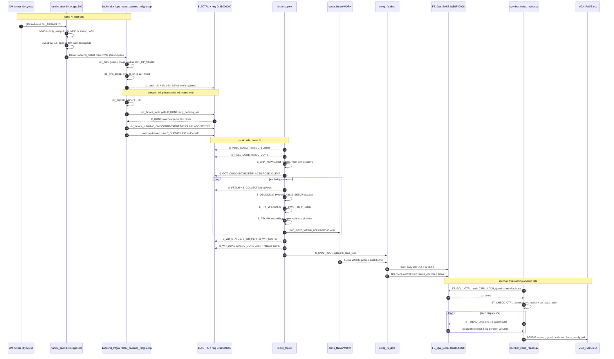
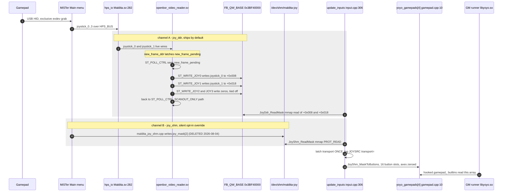
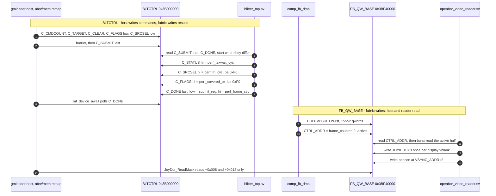
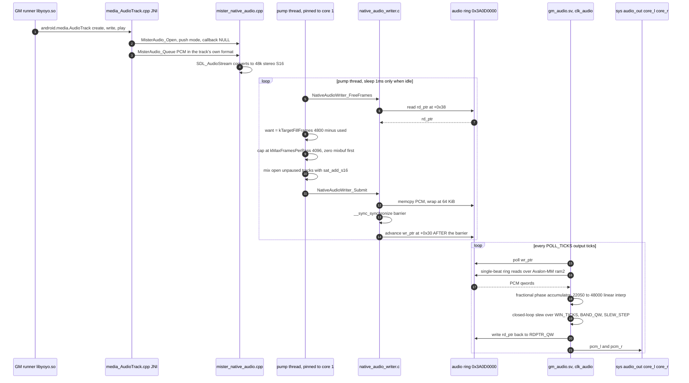

# Data flows (runtime sequences)

**What this answers:** what actually happens, in order, when one frame is
drawn, when a button press reaches the GameMaker VM, when a control word is
written or read, and when a block of PCM reaches the DAC — across the host
process, the DDR3 shared regions, and the fabric. The C1-C4 docs describe
*structure*; this doc describes *ordering*, and records the failure mode each
ordering rule exists to prevent.

**Scope and provenance.** Every participant name below is the module,
function, FSM state, or register name already established in
`docs/architecture/01-context.md` … `docs/architecture/04-code-libmfgpu-pipeline.md`
and is reused verbatim. Where this doc adds a fact those docs do not carry, it
cites source directly. Repo pins are recorded after `## Sources`, per the doc
set's convention.

---

## 1. Frame lifecycle — draw call to lit pixel

The shipping path (`GMLOADER_RASTER=mfgpu`) is **pipelined by one frame**: the
host does not wait for the fabric to finish frame N before emitting frame N —
it waits at the *head* of frame N's `mf_frame_end()`, and what it waits for is
frame **N-1**. Three independent producer/consumer pairs are therefore in
flight at once: the host emitting N, the blitter rasterizing N-1, and the
scanout reader displaying whatever `comp_fb_dma` last published.

### Ordering rules this diagram encodes

**The two doorbells are mirror images.** `mf_device_publish()` writes every
other control word first and `C_SUBMIT` **last**
(`external/gmloader-next/gmloader/mister/raster_backend_mfgpu.cpp:946-960`),
because the fabric latches the whole control block the instant `S_CHK_NEW`
sees `C_SUBMIT != C_DONE`. Symmetrically the fabric writes every perf word
first and `C_DONE` **last** in `S_WR_DONE`
(`maldita.castilla-mister/fpga/rtl/blitter_top.sv:1802`), so a host that
returns from `mf_device_await()` is guaranteed all perf words are already in
DDR3. Neither is cosmetic; both are documented in
`docs/architecture/04-code-libmfgpu-pipeline.md` §2 and
`docs/architecture/04-code-fabric-raster.md` §3.

**`comp_fb_dma` copies pixels before it publishes the pointer.** The 15552-qword
burst into `BUF0`/`BUF1` completes, and only then does one held write place
`{frame_counter, 1'b0, wr_target}` at `CTRL_ADDR`
(`maldita.castilla-mister/fpga/rtl/comp_fb_dma.sv:145,250-263`). The reader
therefore can never latch an `active` bit pointing at a half-written half.

**The reader latches `buf_base_addr` once per frame.** `ST_CHECK_CTRL` copies
`ctrl_word[0]` into `active_buffer` and the matching base into `buf_base_addr`
and holds both for the whole frame
(`maldita.castilla-mister/fpga/rtl/openbor_video_reader.sv:786-793`), so a
mid-frame `comp_fb_dma` flip cannot tear.

**Poll-before-issue.** The reader is the f2h arbiter's default owner and never
asserts a request into a busy slot: every `ddr_rd`/`ddr_we` site is guarded by
`if (!ddr_busy)`, stated in the source at
`maldita.castilla-mister/fpga/rtl/openbor_video_reader.sv:822-824` with the
scanline gate itself at `:825`. The blitter is the *borrower* and uses the
other half of the same discipline — hold-until-accepted in `S_RD_WAIT` /
`S_WR_WAIT` (`blitter_top.sv:1906-1921`). Asserting on ownership instead of on
a free slot is the A1 corruption-lines livelock; see
`docs/architecture/04-code-fabric-raster.md` §7(a), not re-derived here.

### Failure modes

**Stale-frame watchdog — the display blanks about half a second after the
control word stops advancing. Verified.** When `ST_CHECK_CTRL` finds
`ctrl_word[31:2]` unchanged and `first_frame_loaded` is set, it re-scans the
same buffer and bumps `stale_vblank_count`; at `>= 5'd29` it clears
`frame_ready_reg` (`openbor_video_reader.sv:802-807`). `frame_ready_reg` is
2-FF synchronized into `clk_vid` as `frame_ready_vid` (`:289-297`), and the
pixel output is gated `if (de && frame_ready_vid)` with an explicit zero in the
else arm (`:984-992`) — so the VGA pins go to black, not to a frozen last
frame. 30 stale display frames at ~60 Hz is the ~0.5 s figure. The counter is
cleared and `frame_ready_reg` re-set on the next completed scan
(`:789`, `:878-879`), so the blanking self-heals the moment `comp_fb_dma`
resumes. **Consequence for debugging:** a black screen means the *control word*
stopped advancing, which can be a dead blitter, a dead `comp_fb_dma`, or a dead
f2h path — it does not by itself localize the fault.

**f2h first-read reissue watchdog — `S_RD_WAIT` timeout. Verified.** An f2h read
accepted during the core-load port bring-up window can lose its response beat
outright; device evidence recorded in-source is that ~50 % of launches parked on
the **first** `C_SUBMIT` poll with `rd_issued=1` and `C_DONE` never written —
the frame-1 wedge. `S_RD_WAIT` counts `rw_wd` up to `RW_WD_MAX` and then
re-arms the issue phase, incrementing `rd_reissue_cnt`
(`blitter_top.sv:1893-1917`, counter at `:1038-1042`). `RW_WD_MAX` is
deliberately larger than `ddr_blitter_arb`'s `FLUSH_QUIET_MAX` so a reissued
read can never pair with a stale expectation-queue entry; reads are
side-effect-free, so reissue is idempotent. **Verified in the shipping build:**
`FLUSH_QUIET_MAX` = `20'hFFFFF` (2^20−1,
`maldita.castilla-mister/fpga/rtl/ddr_blitter_arb.sv:49`) with no override at
its instantiation (`Maldita.sv:749` passes only `.ENABLE(1'b1)`), and
`RW_WD_MAX` = `22'h3FFFFF` (2^22−1) because `blitter_top` is instantiated with
no parameter override at all (`Maldita.sv:621`). The inequality holds by a
factor of 4.

**Host-side stall — `mf_device_await()` timeout.** If `C_DONE` never reaches
`g_pending_seq` within `MF_DEV_DONE_TIMEOUT_MS` (200 ms) the host logs a timeout
and leaves `g_fabric_pending = true`, so the next frame *drops* rather than
re-emitting into a ring the fabric may still be reading
(`raster_backend_mfgpu.cpp:974-1036`). After `mf_drop_limit()` consecutive drops
it reclaims the ring. This is the host's only protection against a wedged
fabric; it degrades frame rate rather than corrupting the ring.

---

## 2. Input — gamepad to GameMaker VM

Two transports carry the same 9-bit mask into the same engine-owned array, and
**both are initialized every run**. Selection is latched once, on the first
frame, and never re-evaluated
(`external/gmloader-next/gmloader/input.cpp:306-339`, inside
`#ifdef MISTER_NATIVE_VIDEO`): joy-shm wins if a Main_MiSTer-side producer
published `/dev/shm/maldita-joy` before that first frame, otherwise joy-ddr,
otherwise raw SDL `GameController` polling. The in-source comment states the
intent plainly — joy-shm is "explicit opt-in; wins when a producer is running",
joy-ddr is "the default path" (`input.cpp:322-325`). **On the shipping device
build with no shm producer running, joy-ddr is what carries input.**

### Why the JOY writeback is anchored at `ST_POLL_CTRL`

`ST_POLL_CTRL` services `new_frame_pending` (to `ST_WRITE_JOY0`) and
`beacon_pending` (to `ST_BEACON`) **before** it issues the `CTRL_ADDR` read
(`openbor_video_reader.sv:739-761`). The in-source rationale is explicit and
matches what `docs/architecture/03-components-fabric.md` already records: once
frames stream, the fetch loop cycles `ST_POLL_CTRL → ST_CHECK_CTRL →
ST_READ_LINE` and **never visits `ST_IDLE`**, so anything anchored at `ST_IDLE`
starves. `ST_IDLE` still carries the same dispatch arms (`:562-585`) but is
reached only on timeout or frame end.

### Failure mode

**`ST_IDLE` starvation — "input death". Verified, and fixed.** The device
symptom recorded in the source comment (`openbor_video_reader.sv:740-748`) was
that the joystick words froze at their boot values and the liveness beacon
fired exactly **once**: both were `ST_IDLE`-anchored, and once scanout began
streaming, `ST_IDLE` was unreachable. The host side sees this as a controller
that works for a moment at boot and then does nothing, with no error anywhere —
`JoyDdr_ReadMask()` keeps returning a well-formed but frozen mask
(`external/gmloader-next/gmloader/mister/joy_ddr_reader.cpp:44-48`). The fix
was to move both anchors to `ST_POLL_CTRL`, which provably runs every frame
because the control word is observed flipping.

**Silent transport substitution.** Because selection is latched on frame 1 and
a failed shm injection is indistinguishable from a working one, a scripted
bench run could silently fall back to the physical joystick and sit on the
title screen for its whole life. That is why `update_inputs()` logs the winning
transport exactly once as `JOYSRC transport=shm|ddr|sdl`
(`input.cpp:310-317`) — the log line is the only in-band evidence of which
channel is live.

**`joystick_2`/`joystick_3` are structurally dead.** They are tied to `32'd0`
at the reader instantiation (`maldita.castilla-mister/fpga/Maldita.sv:1135-1136`),
and the host reader caps at `JOYDDR_MAX_PLAYERS = 2`
(`joy_ddr_reader.cpp:16`). Players 3 and 4 cannot work on either channel; the
shm contract is likewise 2 players (`MALDITA_JOY_MAX_PLAYERS`,
`external/gmloader-next/gmloader/mister/mister_joy_shm.h:26`).

---

## 3. Control-word contract

There are **two** control blocks, ~15 MB apart inside the same 16 MiB window,
with opposite write directions — the distinction `docs/architecture/02-containers.md`
already draws and this section makes word-exact. `C_SUBMIT`/`C_DONE` live in
**`BLTCTRL` at `0x3B000000`**, *not* at `FB_QW_BASE`; `FB_QW_BASE` at
`0x3BF40000` is the scanout reader's block, which the host only ever reads.

### `BLTCTRL` @ `0x3B000000` — qword registers

Register indices are the same on both sides: RTL
`maldita.castilla-mister/fpga/rtl/blitter_defs.vh:69-104`, host
`MF_C_*` enum `external/gmloader-next/gmloader/mister/raster_backend_mfgpu.cpp:604-607`.

| Byte | Name (qw) | Writer | Reader | Meaning |
|---|---|---|---|---|
| `+0x00` | `C_SUBMIT` (0) | host `mf_device_publish` (`raster_backend_mfgpu.cpp:960`) | fabric `S_POLL_SUBMIT` (`blitter_top.sv:1045`) | **doorbell.** Batch sequence number; written **last**, after the barrier. `submit != done` starts a frame. |
| `+0x08` | `C_CMDCOUNT` (1) | host publish (`:946`) | `S_GOT_CMDCNT` (`blitter_top.sv:1066`) | number of 4-qword commands in the ring for this batch |
| `+0x10` | `C_TARGET` (2) | host publish (`:947`) | `S_GOT_TARGET` (`:1071`) | display buffer select; picks `target_base` = `FB0_QW`/`FB1_QW` |
| `+0x18` | `C_CLEAR` (3) | host publish (`:948`) | `S_GOT_CLEAR` (`:1101`) | clear colour, consumed only when `cfg_flags[0]` is set |
| `+0x20` | `C_FLAGS` (4) | **low:** host publish (`:949`); **high:** fabric `S_WR_COVPX` (`:1796`, `be=0xF0`) | **low:** `S_GOT_FLAGS` (`:1080`); **high:** host | low = per-frame flags (bit 0 = clear); high 32 bits = `perf_covered_px` published back |
| `+0x28` | `C_DONE` (5) | fabric `S_WR_DONE` (`:1802`) | host `mf_device_await` (`raster_backend_mfgpu.cpp:990`) | **release barrier**, written last. low = `submit_reg` echo, high = `perf_frame_cyc` |
| `+0x30` | `C_STATUS` (6) | fabric `S_WR_STATUS` (`:1818`) | host | low = OSD mirror + `wd_fire_count`; high = `perf_texwait_cyc` |
| `+0x38` | `C_SRCSEL` (7) | **low:** host publish read-modify-write (`:954-958`); **high:** fabric `S_WR_PERF` (`:1836`, `be=0xF0`) | **low:** `S_GOT_SRCSEL` (`:1088`); **high:** host | low bit 0 (srcsel) and bit 1 (`C_PIPE`) are both **dead**; bit 2 = ring A/B select (`C_RINGSEL_BIT`); bits [15:8] = live f2h write throttle. high 32 bits = `perf_tri_cyc` |
| `+0x40` | ring A base | host `blt_trilist`/`blt_push_tris` | fabric `S_FETCH`/`S_COLLECT` | 256 KiB, 4-qword commands. Ring B at `+0x40000`; source heap at `+0x80000` |

Note the aliasing trap the RTL header records: control-block qword 8 **is** ring
command 0, which is why `C_PIPE` and the ring-select bit had to be carried in
spare bits of the `C_SRCSEL` word rather than a new qword
(`blitter_defs.vh:80-104`).

### `FB_QW_BASE` @ `0x3BF40000` — scanout reader block

Region localparams: `maldita.castilla-mister/fpga/rtl/openbor_video_reader.sv:149-168`
(qword offsets from `FB_QW_BASE`; the byte column is `offset << 3`).
`FB_QW_BASE = 29'h077E8000` is set at `maldita.castilla-mister/fpga/Maldita.sv:218-226`.

| Byte | Name | Writer | Reader | Meaning |
|---|---|---|---|---|
| `+0x00000` | `CTRL_ADDR` | `comp_fb_dma` (`maldita.castilla-mister/fpga/rtl/comp_fb_dma.sv:145,155-158`) | reader `ST_WAIT_CTRL`/`ST_CHECK_CTRL` (`openbor_video_reader.sv:776-793`) | `[31:2]` = `frame_counter` (reader's change detector and stale watchdog), `[1]` = 0, `[0]` = active framebuffer half |
| `+0x00008` | `JOY0_ADDR` | reader `ST_WRITE_JOY0` (`:600-608`) | host `JoyDdr_ReadMask(0)` (`external/gmloader-next/gmloader/mister/joy_ddr_reader.cpp:14,46`) | `{32'd0, joystick_0}` — P1 button mask, written once per display vblank |
| `+0x00010` | `CART_CTRL_ADDR` | **never written** — `ioctl_download`/`ioctl_wr`/`ioctl_addr`/`ioctl_dout` tied to constants (`Maldita.sv:1126-1129`; `:1130` is `ioctl_wait`, an unconnected output) | — | cart control; structurally dead in the shipping build |
| `+0x00018` | `JOY1_ADDR` | reader `ST_WRITE_JOY1` (`:611-619`) | host `JoyDdr_ReadMask(1)` (`joy_ddr_reader.cpp:15,46`) | `{32'd0, joystick_1}` — P2 button mask |
| `+0x00020` | `JOY2_ADDR` | reader `ST_WRITE_JOY2` (`:622-630`) | nothing — host caps at 2 players (`joy_ddr_reader.cpp:16`) | always zero: `joystick_2` tied `32'd0` (`Maldita.sv:1135`) |
| `+0x00028` | `JOY3_ADDR` | reader `ST_WRITE_JOY3` (`:633-650`) | nothing | always zero: `joystick_3` tied `32'd0` (`Maldita.sv:1136`) |
| `+0x00040` | `BUF0_ADDR` | `comp_fb_dma` burst | reader `ST_READ_LINE` (`:817-853`) | framebuffer half 0, 15552 qwords, 72 qwords per scanline |
| `+0x40040` | `BUF1_ADDR` | `comp_fb_dma` burst | reader `ST_READ_LINE` | framebuffer half 1 |
| `+0x70000` | `VSYNC_ADDR` | reader `ST_WRITE_VSYNC` — **skipped on the ship path** (`SCANOUT_ONLY=1` routes `ST_WRITE_JOY3` straight back to `ST_POLL_CTRL`, `:647`) | host `devmem` probes only | vblank counter for producer pacing; not written by the shipping RBF |
| `+0x70010` | `VSYNC_ADDR + 2` (beacon) | reader `ST_BEACON` (`:588-597`) | `devmem` probes | `{dbg_blt, beacon_cnt}` liveness word. `dbg_blt` is the **live blitter FSM snapshot** wired from `blt_dbg_live` (`Maldita.sv:1145`), so the beacon still reports when the blitter is parked |
| `+0x80000` | `CART_DATA_ADDR` | — | — | cart data staging; gated off with the rest of the ioctl path |
| `+0xB0000` | `DIAG_ADDR` | reader, `SOLARUS_DBG_PROBES` builds only | probe tooling | per-frame reader-health record; byte `0x3BFF0000` |

**Host joy-shm block** (POSIX tmpfs `/dev/shm/maldita-joy`, **not** DDR3 and not
FPGA-visible) — `struct MalditaJoyShm`,
`external/gmloader-next/gmloader/mister/mister_joy_shm.h:32-37`:
`magic` (`+0`, `0x4D414C44`), `version` (`+4`), `generation` (`+8`, bumped per
engine respawn), `joy_mask[0]` (`+12`), `joy_mask[1]` (`+16`). Bit layout is
shared with the DDR channel: bit0 right, bit1 left, bit2 down, bit3 up, bit4
Sword, bit5 Action, bit6 Item1, bit7 Item2, bit8 Pause (`mister_joy_shm.h:15-18`).

### Failure mode

**Probing the wrong base.** The audio ring and the legacy OpenBOR video writer
live at `0x3A000000`; the blitter control block at `0x3B000000`; the reader
block at `0x3BF40000`. `joy_ddr_reader.cpp:8-11` carries the warning in-source:
the ctrl/joy/video words moved to `FB_QW_BASE` as a block and are **not** at the
legacy `0x3A000000` base that `native_video_writer.c` still uses. A `devmem`
peek at the old address reads a live but unrelated region and looks like
plausible garbage rather than an obvious zero.

**Byte-enable writes are not full-word writes.** `S_WR_PERF` and `S_WR_COVPX`
write with `be = 0xF0` — high 32 bits only (`blitter_top.sv:1796,1836`). A
reader that treats `C_FLAGS` or `C_SRCSEL` as a single 64-bit value will mix a
host-written low half with a fabric-written high half. They are two independent
fields sharing a qword by necessity, not one value.

---

## 4. Audio — AudioTrack to DAC

The audio path shares nothing with the render path: a different DDR3 window
(`0x3A000000`), a different fabric consumer (`gm_audio.sv`), a different clock
domain (`clk_audio`, 24.576 MHz), and its own thread on the host. It is
**pull-shaped from the ring's point of view**: the FPGA drain is the clock, and
the host pump refills *to a level* rather than pushing at a fixed rate.

### Ordering rules

**The write barrier is load-bearing.** `NativeAudioWriter_Submit()` copies the
PCM into the ring, issues `__sync_synchronize()`, and only then advances
`wr_ptr` (`external/gmloader-next/gmloader/mister/native_audio_writer.c:135-150`),
so `gm_audio` can never observe a `wr_ptr` pointing past bytes that have not
landed. Same shape as the `C_SUBMIT` doorbell, different bus.

**The `rd_ptr` writeback is not optional.** `gm_audio` is instantiated as the
**sole** Avalon-MM master on `sysmem`'s `ram2` f2h port precisely because the
vendored `ddr_svc` arbiter is read-only and could not carry this writeback
(`maldita.castilla-mister/fpga/sys/sys_top.v:664-700`).
`NativeAudioWriter_FreeFrames()` computes free space from `rd_ptr`; without it
the host sees a ring that never drains and clamps every submit to zero
(`maldita.castilla-mister/fpga/rtl/gm_audio.sv:9-15`).

**Silence is a submit, not an absence of one.** `MisterAudio_PumpOnce()` zeroes
`g_mixbuf` at the top of every pass, because the FPGA FIFO holds its last
sample when starved and a dry ring would park the DAC at a DC level
(`external/gmloader-next/gmloader/mister/mister_native_audio.cpp:294-348`).

### Failure mode

**Underflow / FIFO starvation.** The mechanism present at pin `d585b38` is the
refill-to-target pump: `kTargetFillFrames = 4800` (~100 ms of 48 kHz stereo) is
the level the pump tops the ring back up to, bounded by
`kMaxFramesPerPass = 4096` frames (16 KiB) per pass, with the pump thread
sleeping 1 ms only when `MisterAudio_PumpOnce()` returns 0
(`mister_native_audio.cpp:32-33,130-140,294-305`). Because the loop refills to a
fixed level, the long-run submit rate equals the 48 kHz drain rate and pitch is
exact.

**The specific "4× refill burst" fix is NOT present at this pin — unverified
here.** Project knowledge records a `gmloader-next` PR #18 that fixed an audio
artifact by making the refill burst 4× larger, merged as `cd4d9f1` (PR #19).
That commit is **not reachable in this checkout**: `git cat-file -t cd4d9f1`
fails, and `git log` on `mister_native_audio.cpp` at pin `d585b38` shows the
constants above introduced once, by `e26da9e` ("ring-driven pump pass with
saturating mix and silence floor"), never subsequently changed. Either the fix
landed after `d585b38` and this repo's submodule pin predates it, or it is the
same change under a different description. **The file that would settle it** is
`external/gmloader-next/gmloader/mister/mister_native_audio.cpp` at the
`gmloader-next` commit `cd4d9f1` — fetch that commit and diff
`kTargetFillFrames`/`kMaxFramesPerPass` against the values above. Until then,
do not cite a 4× burst as shipping behaviour.

---

## Verified during the review pass

- **Beacon period — ~42.6 ms.** `beacon_tick` is a free-running 22-bit counter
  on `ddr_clk` (`maldita.castilla-mister/fpga/rtl/openbor_video_reader.sv:460-471`),
  the reader's `ddr_clk` is `clk_sys`
  (`maldita.castilla-mister/fpga/Maldita.sv:1105`), and `clk_sys` is the PLL's
  `outclk_0` at **98.4375 MHz** (`maldita.castilla-mister/fpga/rtl/pll.v:75`,
  wired at `Maldita.sv:311`). 2^22 / 98.4375 MHz = **42.6 ms**
  (~23.5 beacons/s).
- **`FLUSH_QUIET_MAX` = `20'hFFFFF`**, default with no override, so the
  `S_RD_WAIT` reissue-watchdog ordering proof holds — see §1's failure-mode
  note for the full citation chain.
- **`gm_audio`'s slew parameters**: `POLL_TICKS = 512`, `WIN_TICKS = 8192`,
  `BAND_QW = 128`, `SLEW_STEP = 16`
  (`maldita.castilla-mister/fpga/rtl/gm_audio.sv:85-88`), all defaults —
  `maldita.castilla-mister/fpga/sys/sys_top.v:682-700` overrides no parameters,
  as `docs/architecture/03-components-fabric.md` (c) already records.

## Unverified

- **The "4× refill burst" underflow fix** — not reachable at pin `d585b38`; see
  §4's failure-mode note for the exact check that would settle it.
- **The GM runner's own read of `yoyo_gamepads[]`** is via `patch_gamepad`'s
  hooked GML `gamepad_*` builtins per `docs/architecture/03-components-engine.md`;
  the per-builtin mapping from mask bit to GML button index is flagged in
  `external/gmloader-next/gmloader/mister/mister_joy_shm.h:16-18` as
  hardware-verified rather than derivable from source, and was not re-derived
  here.
- **Whether `ascal` participates in any flow above.** It does not for the VGA
  path (`VGA_SCALER` tied `1'b0`, `maldita.castilla-mister/fpga/Maldita.sv:229`);
  the HDMI path exists but is not on this project's validated output, per
  `docs/architecture/02-containers.md`.

## Sources

- `external/gmloader-next/gmloader/mister/blitter.cpp` — `handle_draw`
  (`:500-649`), `Blitter_PresentDefault` routing present through the seam
  (`:666-678`).
- `external/gmloader-next/gmloader/mister/raster_backend_mfgpu.cpp` —
  `MF_C_*` register indices (`:604-607`) and the write-order contract comment
  (`:610-618`), device address constants (`:676-695`), `mf_device_publish`
  (`:936-968`), `mf_device_await` (`:974-1036`), `mf_publish_barrier`
  (`:1145-1158`), `mf_present`/`mf_frame_end` (`:2133-2146`).
- `external/gmloader-next/gmloader/main.cpp` — main-loop present path and the
  fabric-vs-software split (`:775-830`).
- `external/gmloader-next/gmloader/input.cpp` — transport init, one-time
  latch + `JOYSRC` log, per-frame mask read (`:306-339`).
- `external/gmloader-next/gmloader/mister/joy_ddr_reader.cpp` — `FB_QW_BASE`
  base/offsets and the legacy-`0x3A` warning (`:8-16`), `JoyDdr_ReadMask`
  (`:44-48`).
- `external/gmloader-next/gmloader/mister/mister_joy_shm.h` — shm path/magic
  (`:23-26`), bit layout (`:15-18`), `MalditaJoyShm` struct (`:32-37`).
- `external/gmloader-next/gmloader/mister/mister_native_audio.cpp` — pump
  constants (`:26-34`), pump thread (`:130-140`), `MisterAudio_PumpOnce`
  (`:294-348`).
- `external/gmloader-next/gmloader/mister/native_audio_writer.c` — ring/pointer
  addresses (`:25-31`), `Submit` copy + barrier + `wr_ptr` order (`:123-150`).
- `maldita.castilla-mister/fpga/rtl/blitter_top.sv` — control-block prologue
  (`:1045-1101`), frame tail write order (`:1796-1802`, `:1818-1836`),
  `S_RD_WAIT` reissue watchdog (`:1893-1917`) and its dwell counter
  (`:1038-1042`), `S_WR_WAIT` (`:1921`).
- `maldita.castilla-mister/fpga/rtl/blitter_defs.vh` — `BLTCTRL`/ring/heap
  addresses (`:30-59`), control-block offsets and the qword-8 aliasing note
  (`:69-104`).
- `maldita.castilla-mister/fpga/rtl/comp_fb_dma.sv` — copy-then-control-word
  ordering and the control-word format (`:10-23`, `:145`, `:155-158`,
  `:250-263`).
- `maldita.castilla-mister/fpga/rtl/openbor_video_reader.sv` — region
  localparams (`:149-168`), `frame_ready` synchronizer (`:289-298`), beacon
  timer and `new_frame_pending` latch (`:460-479`), `ST_BEACON` (`:588-597`),
  JOY chain (`:600-648`), `ST_POLL_CTRL` rationale (`:739-761`),
  `ST_CHECK_CTRL` incl. the stale-frame watchdog (`:776-812`), `ST_READ_LINE`
  poll-before-issue (`:822-825`), `ST_LINE_DONE` re-arming `frame_ready_reg`
  (`:872-882`), pixel-out blanking gate (`:978-992`).
- `maldita.castilla-mister/fpga/rtl/gm_audio.sv` — writeback rationale
  (`:9-15`), resampler/slew design notes (`:1-49`).
- `maldita.castilla-mister/fpga/Maldita.sv` — `FB_QW_BASE` (`:218-226`),
  `VGA_SCALER` tie-off (`:229`), `hps_io` (`:282`), PLL `outclk_0 -> clk_sys`
  (`:307-312`), `blitter_top` instantiation with no parameter override
  (`:621`), `ddr_blitter_arb` instantiation (`:749`), reader instantiation with
  `ddr_clk = clk_sys` (`:1105`), tied `ioctl_*` (`:1126-1129`), live
  `joystick_0/1`, tied `joystick_2/3`, and `dbg_blt` (`:1103-1146`).
- `maldita.castilla-mister/fpga/sys/sys_top.v` — `gm_audio` as sole `ram2`
  master (`:664-700`).
- `docs/architecture/01-context.md` … `docs/architecture/04-code-libmfgpu-pipeline.md`
  — every participant name in the four diagrams; the poll-before-issue rule,
  the live/dead FSM state inventory, the `0x3B`/`0x3BF4`/`0x3A` address map,
  and the f2h/h2f terminology are reused verbatim, not re-derived.
- `maldita.castilla-mister/fpga/rtl/pll.v` — `outclk_0` = 98.4375 MHz (`:75`),
  the `clk_sys`/`ddr_clk` frequency behind the beacon period.
- `maldita.castilla-mister/fpga/rtl/ddr_blitter_arb.sv` — `FLUSH_QUIET_MAX`
  default (`:49`).

Repo pins: `external/gmloader-next` = `d585b38` (its `3rdparty/mfgpu`
submodule = `9ccd57a`); `maldita.castilla-mister` = `4ef1353` (milestone-a).
